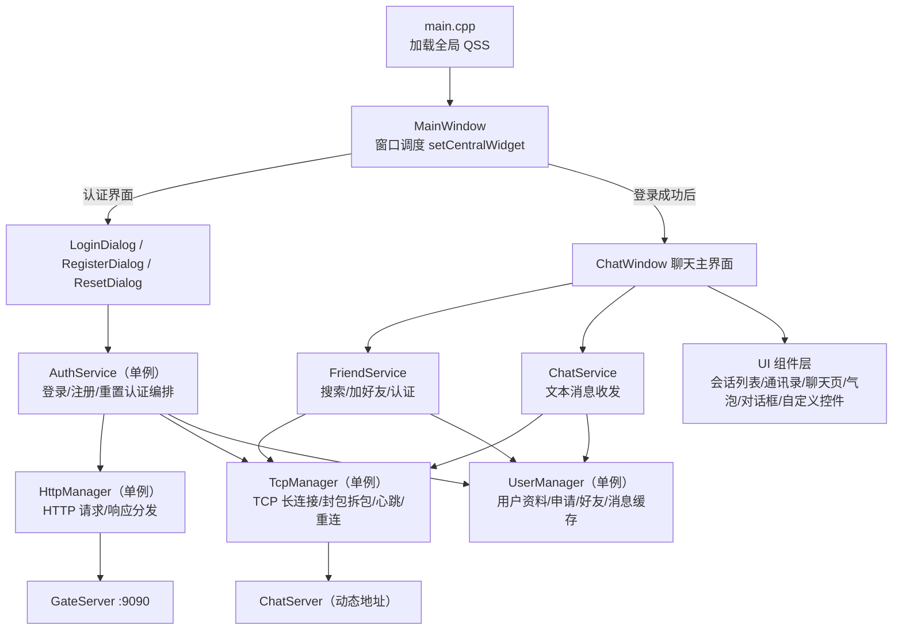
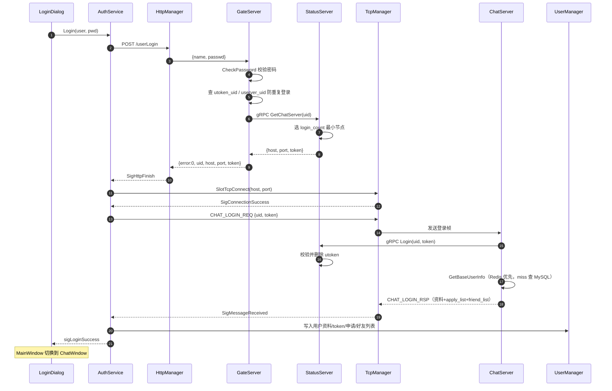
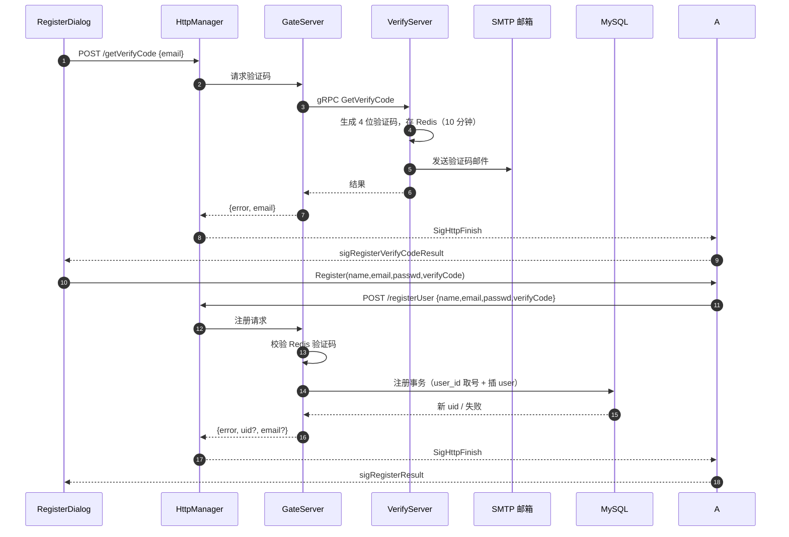
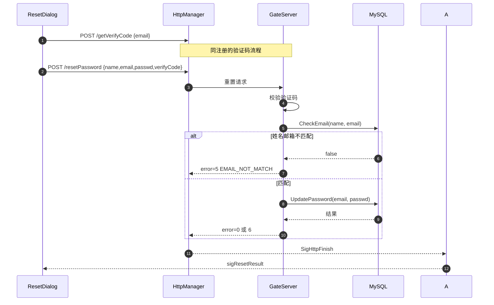
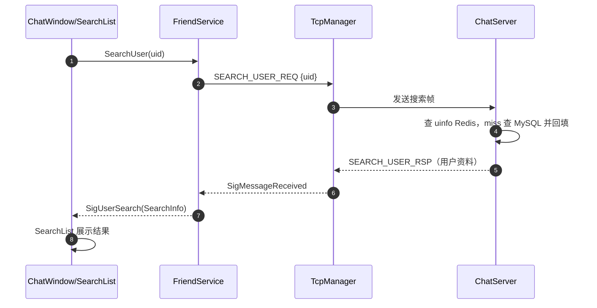
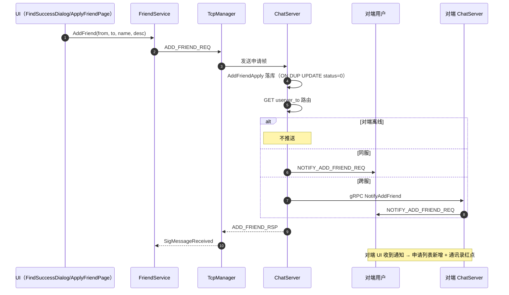
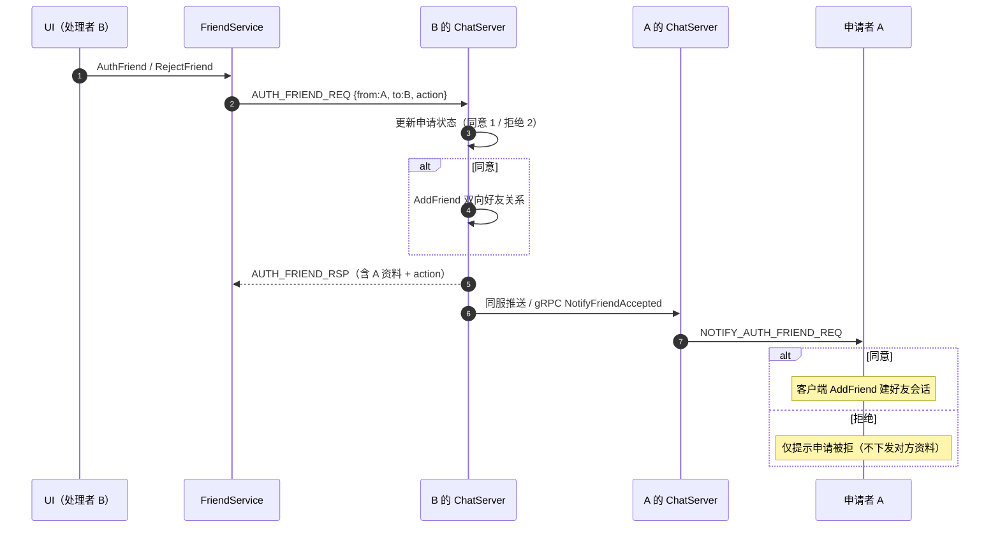
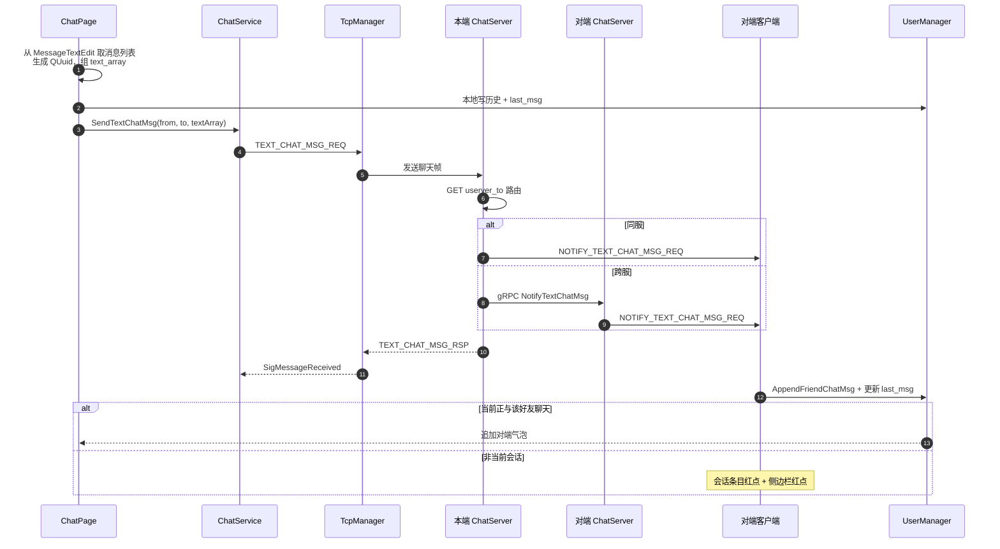
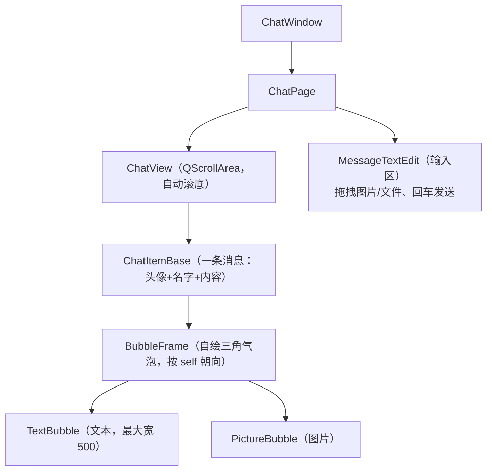
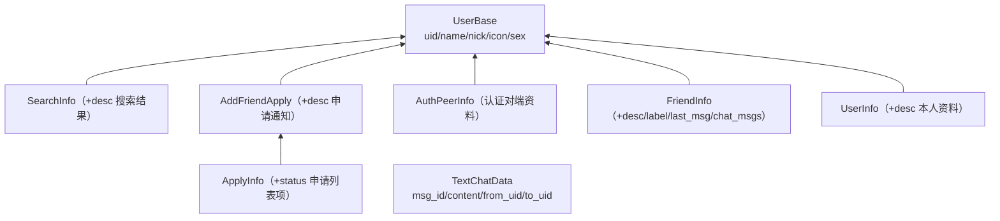

# ChatClient 即时通讯客户端

基于 **Qt 6 / C++17** 的即时通讯桌面客户端。负责用户认证（登录 / 注册 / 找回密码）、与服务端的 HTTP + TCP 通信，以及聊天、通讯录、搜索加好友等界面交互。

- HTTP 接入服务端 GateServer（默认 `http://127.0.0.1:9090`）
- TCP 与 GateServer 分配的 ChatServer 建立长连接，收发好友通知与文本消息

---

## 目录

- [一、技术栈](#一技术栈)
- [二、整体分层架构](#二整体分层架构)
- [三、目录结构](#三目录结构)
- [四、核心业务时序图](#四核心业务时序图)
- [五、TCP 通信协议](#五tcp通信协议)
- [六、聊天主界面（ChatWindow）](#六聊天主界面chatwindow)
- [七、数据模型（userdata.h）](#七数据模型userdatah)
- [八、模块清单](#八模块清单)
- [九、构建与运行](#九构建与运行)
- [十、已知问题与不一致](#十已知问题与不一致)

---

## 一、技术栈

| 类别 | 选型 |
|---|---|
| GUI 框架 | Qt 6 Widgets（`.ui` + `.qss` + `.qrc`） |
| 语言标准 | C++17 |
| 构建 | CMake 3.16+（AUTOMOC / AUTOUIC / AUTORCC） |
| HTTP | `QNetworkAccessManager`（异步，信号槽回调） |
| TCP | `QTcpSocket` + `QDataStream`（自定义二进制帧，大端） |
| JSON | `QJsonDocument` / `QJsonObject` |
| 设计模式 | Meyers 单例、信号槽、业务编排（Service）、setup-method |

---

## 二、整体分层架构



### 分层职责

| 层 | 类 | 职责 |
|---|---|---|
| 入口 | `main.cpp` | 创建 `QApplication`、加载全局 QSS、显示主窗口；`#define NO_DEBUG 1` 决定启动 MainWindow（1）还是直接进 ChatWindow（0，调试用） |
| 窗口调度 | `MainWindow` | 容器，持有各界面指针，用 `setCentralWidget` 做界面切换 |
| 业务编排 | `AuthService` | 编排"HTTP 登录 → TCP 连接 → TCP 登录"完整链路，并承接注册/验证码/重置密码流程，对外只暴露结果信号（单例） |
| 业务服务 | `FriendService` | 搜索用户、加好友、同意/拒绝认证；处理对应服务端通知 |
| 业务服务 | `ChatService` | 文本消息发送、接收通知，写入 UserManager 并通知 UI |
| 通信层 | `HttpManager` | HTTP 请求与响应分发（单例） |
| 通信层 | `TcpManager` | TCP 长连接、协议封包/拆包、心跳、断线重连（单例） |
| 数据层 | `UserManager` | 缓存当前用户资料、token、申请列表、好友列表及各好友消息（单例） |
| 数据模型 | `userdata.h` | `UserBase` 及各派生数据结构、`TextChatData` |
| 编解码 | `JsonCodec` | `JsonParser` / `JsonSerializer`，只负责 JSON ↔ 数据模型 |
| 工具 | `Utils` | 表单校验、服务器 URL 拼接、QSS 加载、提示 |

> **分层约束**：UI 层只调用 Service 层，Service 层只调用 Manager 层；UI 不直接接触 `HttpManager` / `TcpManager`，避免网络细节泄漏到界面代码。

---

## 三、目录结构

```
Client/
├── CMakeLists.txt          # Qt 构建（GLOB 自动纳入 src/inc/ui，新增文件无需改 CMake）
├── rc.qrc                  # 资源文件（style/images 内嵌）
├── README.md
├── src/                    # 全部实现（.cpp）
├── inc/                    # 全部头文件（.h）
├── ui/                     # Qt Designer 界面文件（.ui，17 个）
├── style/                  # QSS 样式表（16 个）
└── images/                 # 图标/头像/loading 等图片资源
```

> ⚠️ **头文件大小写敏感**：Linux 下 `#include` 必须与文件名大小写完全一致（例如 `ChatUserList.h`），大小写不一致在 Windows 能编过、在 Linux 会直接编译失败。

---

## 四、核心业务时序图

### 4.1 登录流程（两段式认证，最核心）

登录不是一次请求完成，而是 **先 HTTP 拿聊天服务器地址和 token，再 TCP 连聊天服务器做二次认证**：



- **第一段 HTTP**：GateServer 校验账号密码 → 查 `userver_{uid}` 防重复 → StatusServer 分配节点并由其写 `utoken_{uid}`
- **第二段 TCP**：ChatServer 通过 gRPC 让 StatusServer 校验 token，通过后回传完整资料
- token 为**一次性消费**（校验后即删），避免重放
- `AuthService` 把链路收敛成 `sigLoginSuccess / sigLoginFailed / sigLoginError`，UI 不直接接触任何 Manager

### 4.2 获取验证码 + 注册



> 验证码倒计时按钮为 `TimerButton`；`/getVerifyCode` 的 `error=3` 表示"用户已存在"、`error=4` 视 VerifyServer 实现而定，以 `Servers/VerifyServer/README.md` 的错误码表为准。

### 4.3 找回密码（重置）



### 4.4 搜索用户



### 4.5 发送好友申请



### 4.6 同意 / 拒绝好友认证



### 4.7 文本聊天



---

## 五、TCP 通信协议

### 帧格式

`TcpManager` 与 ChatServer 之间使用自定义二进制帧（`QDataStream::BigEndian`，与服务端 `htons` 对应）：

```
┌──────────┬──────────┬─────────────────────┐
│  msgId   │ msgLength│        body         │
│ uint16   │ uint16   │   JSON（UTF-8 字节） │
│ 2 字节    │ 2 字节    │  msgLength 字节      │
└──────────┴──────────┴─────────────────────┘
```

- 消息号取值见 `RequestId`（`inc/constants.h`）：业务消息 `10001~10016`，心跳 `CHAT_HEARTBEAT=99999`
- body 为 JSON 文本；心跳包 body 为空
- ⚠️ **服务端单帧 body 硬上限为 2048 字节**（服务端 `MAX_MSG_LENGTH = 1024 * 2`）。客户端侧的上限更宽松（10 MB），发送超长消息会被服务端直接断连，客户端需自行控制单批大小

### 粘包 / 半包处理

- 维护接收缓冲区 `buffer_`：头部不足 4 字节或 body 不足 `msgLength` 时置 `recvPedding_=true`，保留已解析的 msgId/msgLength 等待后续数据
- 每解析出完整帧，从缓冲区截掉头部 / body，循环处理（`forever`）

### 安全保护

| 限制 | 值 | 超限行为 |
|---|---|---|
| 接收缓冲区 | 1 MB（`MAX_RECV_BUFFER_SIZE`） | `socket_.abort()` 断开 |
| 单条消息体 | 10 MB（`MAX_MSG_BODY_SIZE`） | `socket_.abort()` 断开 |

### 心跳与断线重连

| 机制 | 参数 | 行为 |
|---|---|---|
| 心跳 | 间隔 30s（`HEARTBEAT_INTERVAL_MS`） | 连接成功后启动定时器，发空 body 的 CHAT_HEARTBEAT；收到心跳帧直接吞掉（不转发业务层） |
| 自动重连 | 初始 1s，上限 60s | 指数退避：1s→2s→4s→…→60s |
| 重连次数 | 最多 10 次（`MAX_RECONNECT_COUNT`） | 超过后停止并发 `SigReconnectFailed` |
| 主动断开 | — | `Disconnect()` 置 `autoReconnect_=false`，停心跳/重连定时器并 abort，用户退出不再重连 |

> TcpManager 是纯传输层：收到非心跳的完整帧后统一 `emit SigMessageReceived(id, data)`，由各 Service 自行解析，不维护按消息号的 handler 表。

---

## 六、聊天主界面（ChatWindow）

登录成功后进入无边框的 `ChatWindow`：

| 区域 | 组件 | 内容 |
|---|---|---|
| 左侧边栏 | `BadgeButton` ×2（QButtonGroup 互斥） | 聊天 / 通讯录切换，支持未读红点 |
| 左中页面栈 | `QStackedWidget` | chatsPage（会话列表 ChatUserList）/ contactsPage（ContactUserList）/ searchPage（SearchList） |
| 顶部搜索框 | `searchEdit` + SearchList | 有内容时切搜索页；点击搜索列表外部关闭 |
| 右侧内容栈 | `chatDataStackWidget` | ChatPage（聊天页）/ ApplyFriendPage（新的朋友）/ InfoPage（资料页）/ 空白页 |

### 聊天页（ChatPage）组件关系



- **发送**：`OnSendMsgBtnClicked` 遍历 `MsgInfo` 列表；文本生成 QUuid 作 msg_id，累计 `text_array`（单批 ≤1024 字节、单条 ≤1024，超限先 flush），本地先写历史再调 ChatService
- **接收**：当前会话直接 `AppendPeerMessage`；非当前会话只亮红点
- **会话列表**：数据来自 UserManager 的好友列表（分页加载，触底显示 `loading.gif`），不是本地假数据

### 加好友 UI 链路

```
搜索框 → SearchList（结果）→ FindSuccessDialog（用户确认）
        → ApplyFriendDialog/Page（填申请信息）
        → FriendService.AddFriend
```

通讯录 `ContactUserList` 为固定结构：新的朋友（红点入口 → ApplyFriendPage）、自己（→ InfoPage 自身资料）、联系人分组（点击 → 好友 InfoPage）。

---

## 七、数据模型（userdata.h）



- 好友的备注名（`name_`）与标签（`label_`）目前只在本地编辑，服务端同步协议未接入
- `MsgInfo{msgFlag:"text/image/file", content, pixmap}` 是输入区待发消息的载体

> ⚠️ **`UserManager` 存在未初始化成员**：`inc/usermanager.h` 中的部分成员变量声明后未赋初值，读取前务必确认已由登录流程写入，否则可能读到脏值。

---

## 八、模块清单

### 业务与通信

| 文件 | 说明 |
|---|---|
| `main.cpp` | 程序入口，加载全局 QSS |
| `mainwindow.*` | 窗口调度与界面切换 |
| `authservice.*` | 认证服务单例：登录两段式编排 + 注册/重置密码流程 |
| `friendservice.*` | 搜索 / 加好友 / 认证及通知处理 |
| `chatservice.*` | 文本消息收发与通知处理 |
| `httpmanager.*` | HTTP 传输单例，按 RequestId 抛出 SigHttpFinish，不感知业务 |
| `tcpmanager.*` | TCP 单例，封包/拆包、心跳、重连 |
| `usermanager.*` | 用户/申请/好友/消息数据单例 |
| `jsoncodec.*` | JSON 解析与序列化（JsonParser/JsonSerializer） |
| `userdata.*` | 数据模型实现 |
| `utils.*` | 表单校验、URL 拼接、QSS 加载 |
| `constants.h` | ErrorCodes / RequestId / HttpPaths / ServerInfo / MsgInfo |
| `noncopyable.h` | DISALLOW_COPY_MOVE 宏 |
| `log.h` | 客户端日志宏（映射 qDebug 等） |

### 聊天与消息 UI

| 文件 | 说明 |
|---|---|
| `chatwindow.*` | 主界面，页面切换与全局交互 |
| `chatpage.*` | 聊天页（历史渲染、发送、接收追加） |
| `chatview.*` | 消息滚动区 |
| `chatitembase.*` | 单条消息容器 |
| `bubbleframe.*` | 气泡基类（自绘三角） |
| `textbubble.*` / `picturebubble.*` | 文本 / 图片气泡 |
| `messagetextedit.*` | 输入框（拖拽、回车发送） |
| `chatuserlist.*` | 会话列表（分页加载） |

### 通讯录 / 搜索 / 加好友 UI

| 文件 | 说明 |
|---|---|
| `contactuserlist.*` / `contactuseritem.*` | 通讯录列表与条目 |
| `searchlist.*` | 搜索结果列表 |
| `findsuccessdialog.*` | 搜索命中确认弹窗 |
| `applyfriendpage.*` / `applyfrienditem.*` / `applyfriendlist.*` | 新的朋友页、条目、列表 |
| `applyfrienddialog.*` | 好友申请对话框 |
| `friendlabel.*` | 标签选择控件 |
| `userwidget.*` / `listitembase.*` / `adduseritem.*` / `grouptipitem.*` | 列表项基础组件 |
| `infopage.*` | 好友 / 自己资料页 |
| `loadingdialog.*` | 加载提示 |

### 认证 UI 与通用控件

| 文件 | 说明 |
|---|---|
| `logindialog.*` / `registerdialog.*` / `resetdialog.*` | 登录 / 注册 / 重置对话框 |
| `timerbutton.*` | 获取验证码倒计时按钮 |
| `qclicklabel.*` / `clickedoncelabel.*` | 可点击标签（多状态图 / 单次点击） |
| `badgebutton.*` | 未读红点按钮 |

---

## 九、构建与运行

### 依赖

- Qt 6（Widgets / Network / Gui / Core），推荐 **6.5+**
- CMake **3.16+**、支持 C++17 的编译器（GCC 9+ / Clang 10+ / MSVC 2019+）

### 编译

```bash
# 在 Client 目录下执行（假设你已经克隆到本地，路径按实际调整）
cd <repo>/Client

cmake -S . -B build -DCMAKE_BUILD_TYPE=Release
cmake --build build -j$(nproc)
```

如需指定 Qt 路径：`cmake -S . -B build -DCMAKE_PREFIX_PATH=/path/to/Qt/6.x/gcc_64`

**编译排错**

| 现象 | 原因 / 处理 |
|---|---|
| `Cannot find Qt6Config.cmake` | Qt 未安装或未在 `PATH`；用 `-DCMAKE_PREFIX_PATH` 指定 Qt 安装目录 |
| `fatal error: 'xxx.h' file not found`（仅 Linux） | 头文件大小写不匹配，改用与磁盘文件名完全一致的大小写 |
| UI 改动不生效 | `AUTOUIC` 生成物在 `build/` 下，改动 `.ui` 后重新 `cmake --build build` 即可 |

### 运行

| 平台 | 命令 |
|---|---|
| Linux / macOS | `./build/ChatClient` |
| Windows | `build\Debug\ChatClient.exe` |

> ⚠️ **运行前必须改服务器地址。** 服务器 host/port 硬编码在 `src/utils.cpp`：

```cpp
constexpr char SERVER_HOST[] = "81.69.247.52";   // 改成你的 GateServer 地址
constexpr int  SERVER_PORT = 9090;
```

本地调试请改为 `127.0.0.1`。**建议后续将其改为读取配置文件或环境变量**，避免每次换环境都要重新编译。

### 与后端联调前的检查清单

1. `Servers/*` 已全部拉起（`./start.sh` 后 `./status.sh` 全绿）
2. 客户端 `SERVER_HOST` 与服务端 GateServer 地址一致
3. 防火墙放行 9090（HTTP）以及 50061/50062（TCP 聊天）
4. 若走公网，`Servers/StatusServer/config.ini` 里的 ChatServer 地址必须是客户端可达的地址（不能是 `127.0.0.1`）

---

## 十、已知问题与不一致

| # | 问题 | 现状 / 建议 |
|---|---|---|
| 1 | 服务端不做消息持久化 | 聊天历史只在客户端内存，重登/换设备后历史丢失；离线消息也无补发（靠登录拉好友列表，无未读消息） |
| 2 | 无心跳超时检测 | 对端网络静默断开时，连接状态依赖 TCP keepalive（默认 2 小时以上）才会发现 |
| 3 | 服务器地址写死 | GateServer host/port 硬编码在 `src/utils.cpp`，建议改为配置/环境变量 |
| 4 | 备注名 / 标签仅本地 | UserManager 的修改不会同步到服务端 |
| 5 | 文件 / 图片消息未走协议 | 输入框支持拖拽、图片气泡可渲染，但未通过服务端转发（只有文本贯通） |
| 6 | `UserManager` 成员未初始化 | `inc/usermanager.h:61-62` 附近成员未赋初值，存在读到脏值的风险 |
| 7 | 令牌存储位置 | 登录 token 保存在内存中的 UserManager，未落盘；退出即失效（安全上是好的，但也没有"记住我"） |
| 8 | 单帧 2048 字节限制 | 客户端允许 10 MB 但服务端只收 2048 字节，长文本会被服务端断连，需在协议层统一 |

---

## 相关文档（服务端）

| 文档 | 说明 |
|---|---|
| [../README.md](../README.md) | 项目总览与快速开始 |
| [../Servers/README.md](../Servers/README.md) | 服务端集群总览 |
| [../Servers/common/README.md](../Servers/common/README.md) | 公共库与协议契约 |
| [../Servers/GateServer/README.md](../Servers/GateServer/README.md) | HTTP 接口与时序 |
| [../Servers/ChatServer/README.md](../Servers/ChatServer/README.md) | TCP 协议、好友/聊天业务 |
| [../Servers/StatusServer/README.md](../Servers/StatusServer/README.md) | 节点分配与 token |
| [../Servers/VerifyServer/README.md](../Servers/VerifyServer/README.md) | 验证码服务 |
| [../Servers/DEPLOY.md](../Servers/DEPLOY.md) | 部署与排错 |
