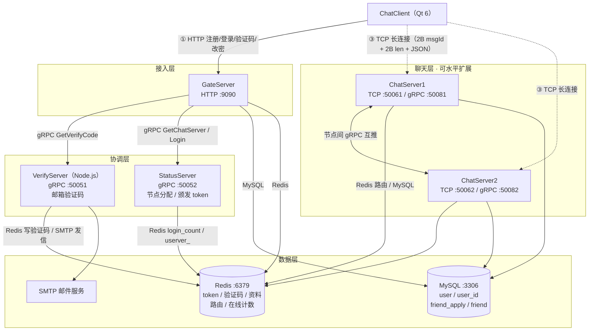
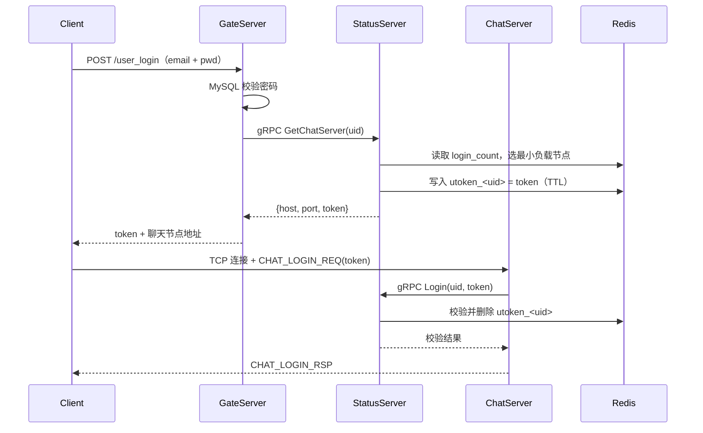

# Chat 分布式即时通讯系统

一个完整的即时通讯（IM）教学 / 实战项目：**Qt 6 桌面客户端 + 多节点服务端集群**。支持邮箱验证码注册 / 登录 / 改密、最小连接数负载均衡、聊天节点水平扩展、好友申请与认证（同服 / 跨服）、批量文本消息实时转发。

> 本 README 只做**总览与入口导航**。各子系统的细节请跳转到对应目录的 README。

---

## 目录

- [一、能力概览](#一能力概览)
- [二、仓库结构](#二仓库结构)
- [三、系统架构](#三系统架构)
- [四、核心链路](#四核心链路)
- [五、技术栈与端口](#五技术栈与端口)
- [六、快速开始](#六快速开始)
- [七、文档索引](#七文档索引)
- [八、已知限制](#八已知限制)
- [九、许可](#九许可)

---

## 一、能力概览

| 能力 | 说明 | 实现位置 |
| --- | --- | --- |
| 邮箱验证码注册 / 登录 / 改密 | HTTP + gRPC 邮件验证码 | GateServer + VerifyServer |
| 两段式登录 | HTTP 换取 token → TCP 长连接校验 token | GateServer + StatusServer + ChatServer |
| 最小连接数负载均衡 | 依据 Redis `login_count` 哈希选节点 | StatusServer |
| 聊天节点水平扩展 | 多 ChatServer 实例，节点间 gRPC 互推 | ChatServer |
| 好友申请 / 认证 | 同服直推、跨服 gRPC 转发 | ChatServer |
| 实时文本消息 | 批量消息转发、已读状态 | ChatServer |
| 在线会话管理 | 会话表 + Redis 路由/在线计数 | ChatServer + Redis |

---

## 二、仓库结构

```
chat/
├── Client/                     # Qt 6 / C++17 桌面客户端
│   ├── src/  inc/              #   实现与头文件
│   ├── ui/  style/  images/    #   Designer 界面、QSS 样式、图片资源
│   └── README.md               #   客户端文档（架构图 + 关键操作时序图）
│
└── Servers/                    # 服务端集群（顶层 CMakeLists 在此）
    ├── common/                 #   公共静态库 libchat_common.a（协议/常量/日志/配置/连接池）
    ├── GateServer/             #   HTTP 网关（Boost.Beast :9090）
    ├── ChatServer/             #   TCP 聊天节点（可多实例，含节点间 gRPC）
    ├── StatusServer/           #   gRPC 协调服务（节点分配 / token 颁发与校验）
    ├── VerifyServer/           #   Node.js 邮件验证码服务（gRPC）
    ├── start.sh / stop.sh / status.sh
    ├── logs/
    ├── README.md / DEPLOY.md / REFACTORING.md
    └── 各目录下均有 README.md
```

> ⚠️ **仓库根目录没有 `CMakeLists.txt`。** 服务端构建入口是 `Servers/`，客户端构建入口是 `Client/`，两者相互独立。

---

## 三、系统架构



**分层职责**

| 层 | 组件 | 职责 |
| --- | --- | --- |
| 接入层 | GateServer | 对外唯一 HTTP 入口；无状态，可前置 Nginx 横向扩展 |
| 协调层 | StatusServer / VerifyServer | 节点分配、token 生命周期、验证码下发 |
| 聊天层 | ChatServer | TCP 长连接、会话管理、消息路由与跨服转发 |
| 数据层 | Redis / MySQL / SMTP | 临时态与计数 / 持久化 / 验证码通道 |

---

## 四、核心链路

### 1. 两段式登录



**要点**：token 一次性消费（校验后即删），避免重放；HTTP 阶段不建立长连接，TCP 阶段不再传密码。

### 2. TCP 自定义帧

```
+--------+--------+---------------------+
| msgId  |  len   |        body         |
| uint16 | uint16 |  len 字节的 JSON    |
| 大端序 | 大端序 |                     |
+--------+--------+---------------------+
          2B        2B          变长
```

- `msgId` 取值见 `Servers/common/include/chat/constants.h` 的 `MSG_IDS`（10001 ~ 99999）。
- 单帧 body **硬上限 2048 字节**（服务端 `MAX_MSG_LENGTH = 1024 * 2`，定义在 `Servers/ChatServer/src/csession.h`），超出直接断开。
- **每次发送前必须重置长度字节**：复用发送缓冲区时若忘记写回 `len`，会出现「首帧正常、后续帧被截断」的隐蔽 bug。

---

## 五、技术栈与端口

| 组件 | 技术栈 | 端口 |
| --- | --- | --- |
| Client | Qt 6 Widgets / C++17 / QNetworkAccessManager / QTcpSocket | — |
| GateServer | C++17 / Boost.Asio + Beast / gRPC / MySQL / Redis | 9090 |
| ChatServer | C++17 / Boost.Asio / gRPC / MySQL / Redis | TCP 50061/50062，gRPC 50081/50082 |
| StatusServer | C++17 / gRPC / Redis / MySQL | 50052 |
| VerifyServer | Node.js / @grpc/grpc-js / ioredis / nodemailer | 50051 |
| 存储 | Redis 6+ / MySQL 8+ | 6379 / 3306 |

**依赖版本要求**

| 依赖 | 最低版本 | 说明 |
| --- | --- | --- |
| CMake | **3.20**（服务端） / 3.16（客户端） | 服务端用了 `FetchContent` 等 3.20 特性 |
| C++ 标准 | C++17 | 全项目 |
| Qt | 6.2+（推荐 6.5+） | Widgets / Network / Gui |
| Boost | 1.74+（含 Beast） | 服务端网络层 |
| gRPC / Protobuf | 1.40+ / 3.12+ | 跨服通信 |
| MySQL Connector/C++ | 8.0 | mysqlcppconn |
| hiredis / redis++ | — | Redis 客户端 |

---

## 六、快速开始

### 服务端

```bash
# 1. 安装依赖（以 Ubuntu 22.04 为例）
sudo apt-get update
sudo apt-get install -y build-essential cmake libboost-all-dev \
    libmysqlcppconn-dev libhiredis-dev libssl-dev redis-server mysql-server

# 2. 初始化数据库（含 user_id 发号器表，缺表会导致注册失败）
mysql -uroot -p < Servers/DEPLOY.md 中「数据库初始化」一节的 SQL

# 3. 构建（注意：入口在 Servers/，不是仓库根目录）
cd Servers
mkdir -p build && cd build
cmake .. && make -j$(nproc)     # 并行编译，全量构建通常需要数分钟

# 4. 起服务
cd ..                           # 回到 Servers/
./start.sh                      # 依次拉起 Redis → VerifyServer → GateServer → ChatServer → StatusServer
./status.sh                     # 查看各服务运行状态
```

### 客户端

```bash
cd Client
cmake -B build -DCMAKE_BUILD_TYPE=Release
cmake --build build -j$(nproc)
./build/ChatClient
```

> ⚠️ **首次运行前必须修改服务端地址。** 客户端里存在硬编码的服务器 IP（见 [已知限制](#八已知限制)），本地调试前请先改为 `127.0.0.1`。

### 冒烟验证

服务全部拉起后，用下面三条命令快速确认「网关活着、验证码链路通、聊天端口在听」：

```bash
# ① 网关健康：应返回 HTTP 响应而非连接拒绝
curl -i http://127.0.0.1:9090/

# ② 验证码链路：观察是否返回 code=0（检查 VerifyServer 日志确认 SMTP 状态）
curl -X POST http://127.0.0.1:9090/get_verifycode \
     -H 'Content-Type: application/json' \
     -d '{"email":"test@example.com"}'

# ③ 聊天端口：应处于 LISTEN
ss -ltnp | grep -E '9090|50061|50062|50051|50052'
```

更完整的部署、数据库初始化、排错流程见 **[`Servers/DEPLOY.md`](Servers/DEPLOY.md)**。

---

## 七、文档索引

| 文档 | 内容 |
| --- | --- |
| [Client/README.md](Client/README.md) | 客户端架构、类职责、关键操作时序图、构建与打包 |
| [Servers/README.md](Servers/README.md) | 服务端总览、进程拓扑、构建与运维命令 |
| [Servers/common/README.md](Servers/common/README.md) | 公共库：协议定义、常量、日志、配置、连接池、DAO |
| [Servers/GateServer/README.md](Servers/GateServer/README.md) | HTTP 网关：路由表、请求/响应格式、错误码 |
| [Servers/ChatServer/README.md](Servers/ChatServer/README.md) | 聊天节点：会话管理、消息分发、跨服 gRPC |
| [Servers/StatusServer/README.md](Servers/StatusServer/README.md) | 节点分配与 token 颁发/校验 |
| [Servers/VerifyServer/README.md](Servers/VerifyServer/README.md) | Node.js 验证码服务 |
| [Servers/DEPLOY.md](Servers/DEPLOY.md) | 环境准备、数据库初始化、启动、排错 |
| [Servers/REFACTORING.md](Servers/REFACTORING.md) | 已完成的公共库抽取与分层重构记录 |

---

## 八、已知限制

以下问题在源码中真实存在，**使用前请知悉**（完整改进清单见项目改进建议文档）：

| 类别 | 问题 | 影响 |
| --- | --- | --- |
| 配置 | 客户端硬编码服务器 IP / 端口（`Client/src/utils.cpp`） | 换环境必须改代码重编 |
| 配置 | 各服务 `config.ini` 内明文写库账号密码 | 不可直接入库公网 |
| 配置 | `Servers/StatusServer/config.ini` 里的 ChatServer 地址是公网 IP，本地部署需改成 `127.0.0.1` | 本地起不来连接 |
| 安全 | `Servers/VerifyServer/config.json` 明文存放 QQ 邮箱授权码 | 泄露即被滥用，务必替换 |
| 安全 | 密码以可逆方式存储，非 bcrypt/argon2 | 库泄露即密码泄露 |
| 协议 | 单帧上限 2048 字节，长文本会被截断 | 不支持大消息 |
| 协议 | JSON 文本协议，体积大、无 schema 校验 | 带宽浪费、易错 |
| 架构 | 大量 Meyers 单例 + 构造函数内做 IO | 难做单元测试、难替换实现 |
| 架构 | Redis 键 `userver_` 无 TTL | 用户下线后路由残留 |
| 工程 | 无自动化测试、无 CI | 回归全靠手测 |

---

## 九、许可

本项目为学习 / 教学用途的 IM 实战项目。使用前请自行评估上述已知限制，生产环境需先完成安全加固。
