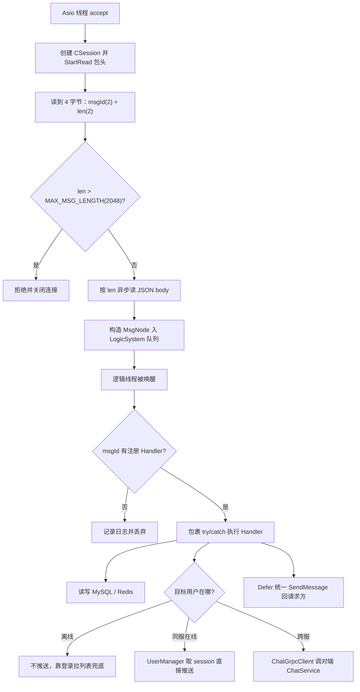
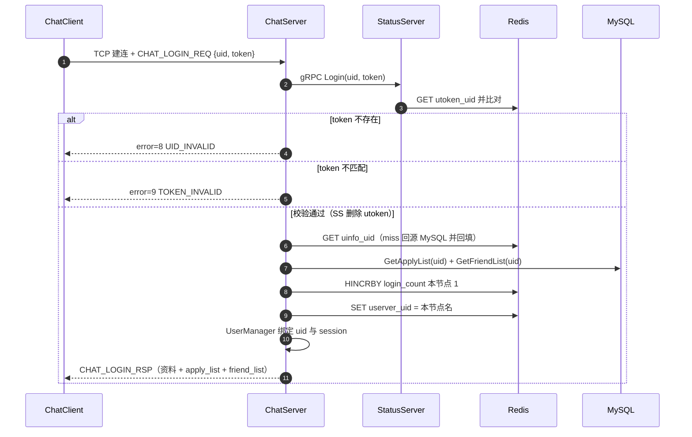
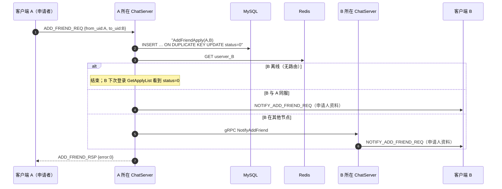
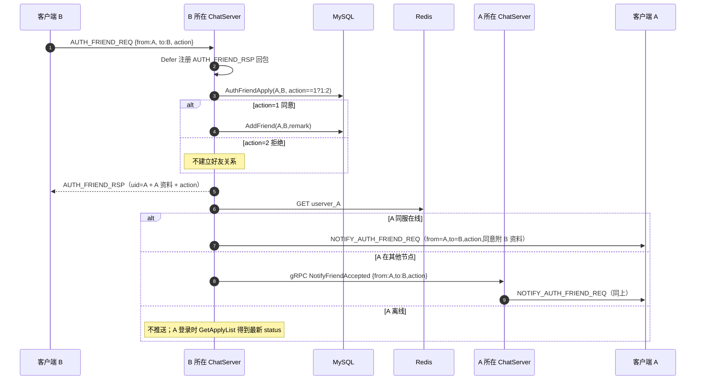
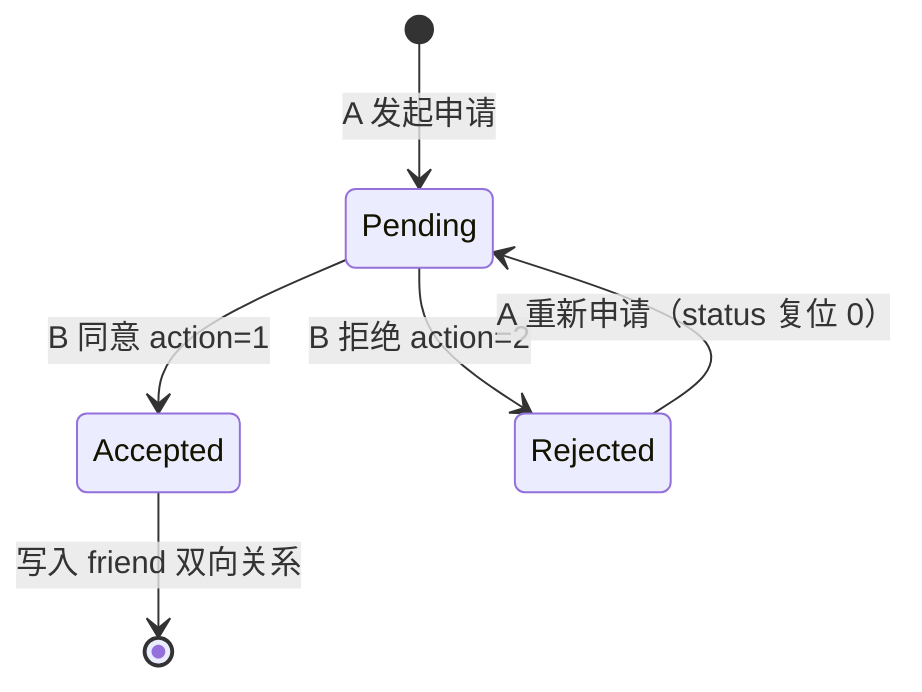
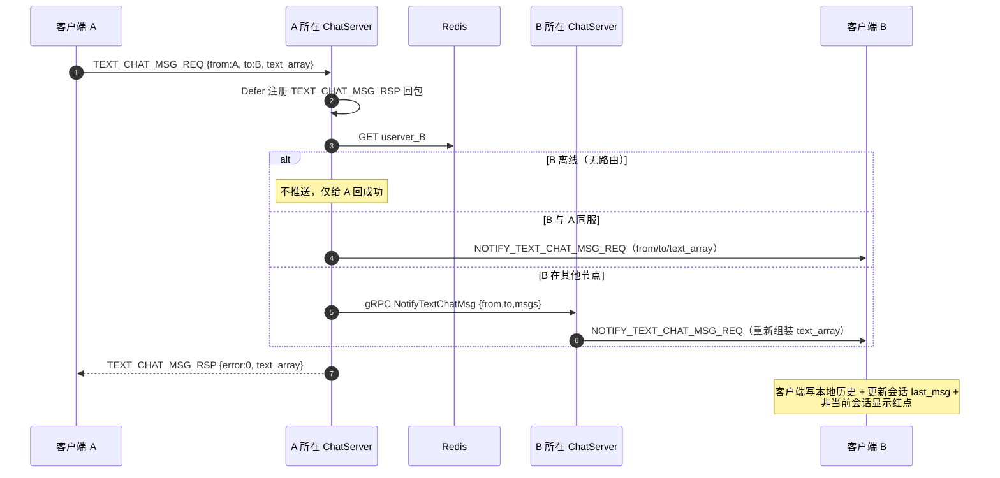

# ChatServer

## 简介

ChatServer 是分布式聊天系统的核心聊天节点，负责客户端的 TCP 长连接、用户登录校验、好友关系维护，以及多节点间通过 gRPC 互相推送好友通知。可部署多个实例（`config.ini` / `config2.ini`），由 StatusServer 按 Redis 中的 `login_count` 做最小连接数分配。

## 目录

- [核心功能](#核心功能)
- [架构组成](#架构组成)
- [内部处理流程](#内部处理流程)
- [消息协议](#消息协议)
- [业务时序](#业务时序)
- [Redis / MySQL 的使用](#redis--mysql-的使用)
- [多实例配置](#多实例配置)
- [开发者注意](#开发者注意)

## 核心功能

- **TCP 连接管理**：基于 Boost.Asio 多 io_context 线程池 accept，每个连接对应一个 `CSession`
- **单线程业务队列**：所有收包反序列化成 `MsgNode` 投递到 `LogicSystem` 的队列，由独立逻辑线程串行处理（业务无锁）
- **登录二次校验**：GateServer 颁发的 token 在建立 TCP 连接后还要经 StatusServer gRPC 校验
- **好友系统**：搜索用户、申请加好友、同意（action=1）/拒绝（action=2）；拒绝后对方重新申请自动复位为待处理
- **文本聊天**：`text_array` 批量承载多条文本（每条带客户端生成的 msg_id），同服直接推 session，跨服走 `ChatService` gRPC
- **跨服通信**：依据 Redis `userver_{uid}` 判断目标所在节点，同服直接推 session，跨服走 `ChatService` gRPC
- **统一回包与异常兜底**：各 Handler 用 `Defer` 保证任何分支都会回包，单条消息处理异常不会杀死逻辑线程

## 架构组成

| 模块 | 说明 |
|------|------|
| CServer | TCP 服务器，accept 连接、管理 session 增删（`RemoveSession`，session 通过 `SetRemoveCallback` 反向通知） |
| CSession | 客户端会话：异步读 4 字节包头 → 读 JSON 体 → 投队列；发送队列 + 异步写 |
| MsgNode | 收包节点（含 msgId、当前长度、扩容逻辑） |
| LogicSystem | 业务核心：注册 `handleFuncs_`（msgId → Handler），单线程消费队列 |
| UserManager | 内存中 uid → shared_ptr\<CSession\> 映射（互斥保护） |
| ChatGrpcClient | 按 `[PeerServer]` 配置为每个对端节点维护一个 gRPC stub 池（每池 5 条） |
| ChatServiceImpl | gRPC 服务端：接收其他节点的 `NotifyAddFriend / NotifyFriendAccepted / NotifyTextChatMsg` |

## 内部处理流程



## 消息协议

帧格式（**网络字节序 / 大端**，通过 `htons`/`ntohs` 转换）：`2 字节 msgId + 2 字节 body 长度 + JSON body`。客户端 Qt 侧对应 `QDataStream::BigEndian`。

> ⚠️ **单帧 body 硬上限 `MAX_MSG_LENGTH = 2048` 字节**（定义在 `csession.h`）。超限的帧会被直接拒绝并断开连接。客户端若发送更长内容，必须自行分批。

### 消息 ID（MSG_IDS）

| 数值 | 名称 | 方向 | body 关键字段 |
|---|---|---|---|
| 10001/10002 | CHAT_LOGIN_REQ/RSP | C↔S | uid, token / 资料 + apply_list + friend_list |
| 10003/10004 | SEARCH_USER_REQ/RSP | C→S | uid（数字字符串） |
| 10005/10006 | ADD_FRIEND_REQ/RSP | C→S | from_uid, to_uid, name, desc, remark_name |
| 10007/10008 | NOTIFY_ADD_FRIEND_REQ/RSP | S→C | apply_uid, name, desc, icon, sex, nick |
| 10009/10010 | AUTH_FRIEND_REQ/RSP | C→S | from_uid, to_uid, **action (1同意/2拒绝)** |
| 10011/10012 | NOTIFY_AUTH_FRIEND_REQ/RSP | S→C | action, from_uid, to_uid（同意附对方资料） |
| 10013/10014 | TEXT_CHAT_MSG_REQ/RSP | C→S | from_uid, to_uid, **text_array[{msg_id,content}]** |
| 10015/10016 | NOTIFY_TEXT_CHAT_MSG_REQ/RSP | S→C | from_uid, to_uid, text_array（对端转发） |
| 99999 | CHAT_HEARTBEAT | C→S | 空 body（客户端 30s 一次；服务端收到即连接存活） |

> proto 中还定义了 `ReplyFriend` / `SendChatMsg` / `NotifyKickUser`，当前暂无业务调用（**踢下线功能未实现**）。

### 好友认证字段约定

统一约定：**from_uid 永远是申请者，to_uid 永远是处理者**。

- `AUTH_FRIEND_RSP` 回给处理者 B：`uid/from_uid`=申请人 A（客户端据此定位申请列表项），并带 A 的 name/nick/icon/sex，同意和拒绝都返回
- `NOTIFY_AUTH_FRIEND_REQ` 推给申请者 A：`from_uid`=A 自己、`to_uid`=B；仅 action=1 时携带 B 的资料，action=2 只下发 id+action
- 旧客户端不带 action 时，服务端默认按 1（同意）处理；proto3 中 `FriendAcceptedReq.action` 默认 0，对端同样归一化为同意

## 业务时序

> 注册、验证码、重置密码、HTTP 登录与节点分配的时序见 [GateServer/README.md](../GateServer/README.md)；节点负载选择见 [StatusServer/README.md](../StatusServer/README.md)。

### TCP 登录二次校验

客户端从 GateServer 拿到 host/port/token 后，与本节点建立 TCP 长连接并发送 `CHAT_LOGIN_REQ`：



### 发送好友申请（A → B，含跨服）



### 同意 / 拒绝好友申请（B 处理 A 的申请，含跨服）

`AUTH_FRIEND_REQ` 携带 `action`：1=同意，2=拒绝；旧客户端不带时默认按 1 处理。



### 好友申请状态机（friend_apply.status）



### 发送文本聊天消息（A → B，含跨服）

客户端把多条文本组成 `text_array`（单批累计上限 1024 字节、单条上限 1024 字节）一次发出：



> 注意：**消息不落 MySQL**，历史消息只在客户端内存保存，重登/换设备后历史丢失（后续可加消息持久化）；离线消息也不补发。

## Redis / MySQL 的使用

| 位置 | 用途 |
|---|---|
| Redis `utoken_{uid}` | Gate/Status 颁发的登录 token，登录时经 StatusServer 校验并删除 |
| Redis `uinfo_{uid}` | 用户资料缓存（未命中回源 MySQL 并回写），会话断开时删除 |
| Redis `userver_{uid}` | 用户所在节点名，跨服路由依据；登录时写入 |
| Redis Hash `login_count` | 各节点在线计数，登录 `HINCRBY +1`，会话断开 `HINCRBY -1`，进程退出 `HDel` 节点 |
| MySQL `friend_apply` | 申请记录，唯一键 (from_uid,to_uid)，`status` 0待处理/1同意/2拒绝 |
| MySQL `friend` | 同意后写入的双向好友关系 |

> 会话断开（`RemoveSession`）时清理 Redis：`login_count` 扣减、删除 `userver_{uid}` 路由（仅当仍指向本节点）、删除 `utoken_{uid}`；被新登录顶掉的旧会话不做清理。
>
> ⚠️ 因为 `utoken_{uid}` **没有 TTL**，进程异常退出时该键会残留，需要靠下次登录覆盖或人工清理。

## 多实例配置

`config.ini`（ChatServer1：TCP 50061 / gRPC 50081）与 `config2.ini`（ChatServer2：TCP 50062 / gRPC 50082）：

```ini
[SelfServer]
Name = ChatServer1
Host = 127.0.0.1
Port = 50061          # 客户端 TCP
RPCPort = 50081       # 节点间 gRPC

[PeerServer]
servers = ChatServer2 # 逗号分隔，启动时为每个节点建立 stub 池

[ChatServer2]
Host = 127.0.0.1
RPCPort = 50082
```

启动时同时监听 TCP 与 gRPC；`start.sh` 分别以 `config.ini`、`config2.ini` 拉起两个实例。

> 💡 **新增节点**：一边加 `config*.ini` 的 `[SelfServer]`，一边要在所有其他节点的 `[PeerServer]` / `[ChatServerN]` 里补齐对端信息，同时更新 `StatusServer/config.ini` 的 `[ChatServers]` 列表。三处必须一致，否则跨服路由会失败。

## 开发者注意

- 业务 Handler 全部运行在**同一个逻辑线程**，禁止在其中做长时间阻塞；跨服 gRPC 为同步调用且**未设 deadline**（待优化，连接挂起会拖住整条业务队列）
- 回包统一用 `Defer`，新增错误分支直接 `return` 即可，不要漏发响应
- 日志使用 `LOG_DEBUG/LOG_INFO/LOG_WARN/LOG_ERROR`，**禁止 `std::cout`**；含 token/密码的请求禁止打印整个 body
- 帧长上限 2048 字节，新增协议字段时注意别把单条消息做超
- 单线程编译验证：`cmake --build build --target chatServer -j1`
