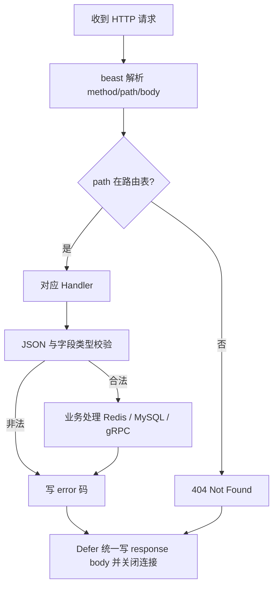
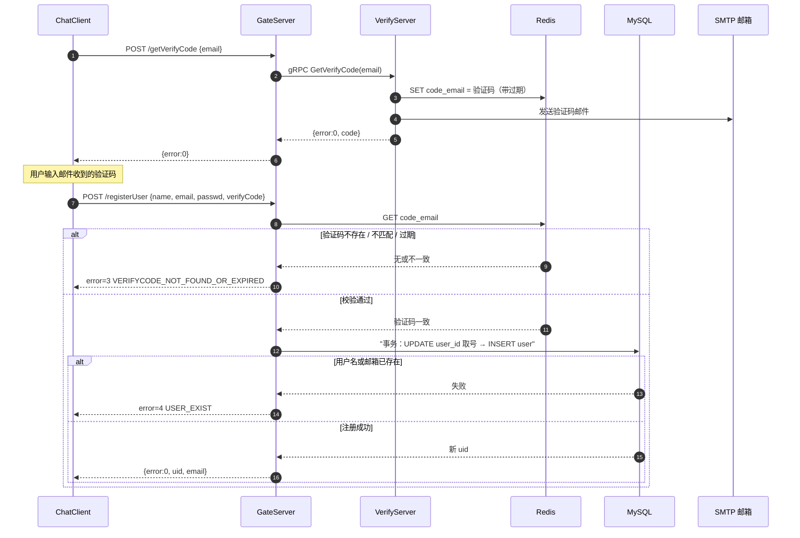
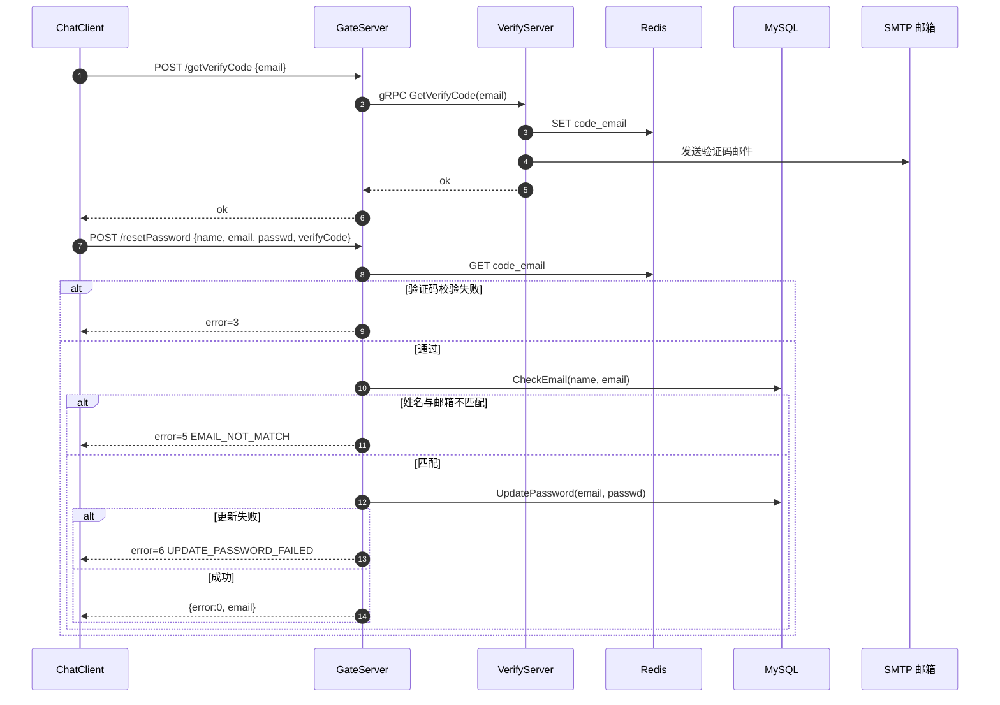
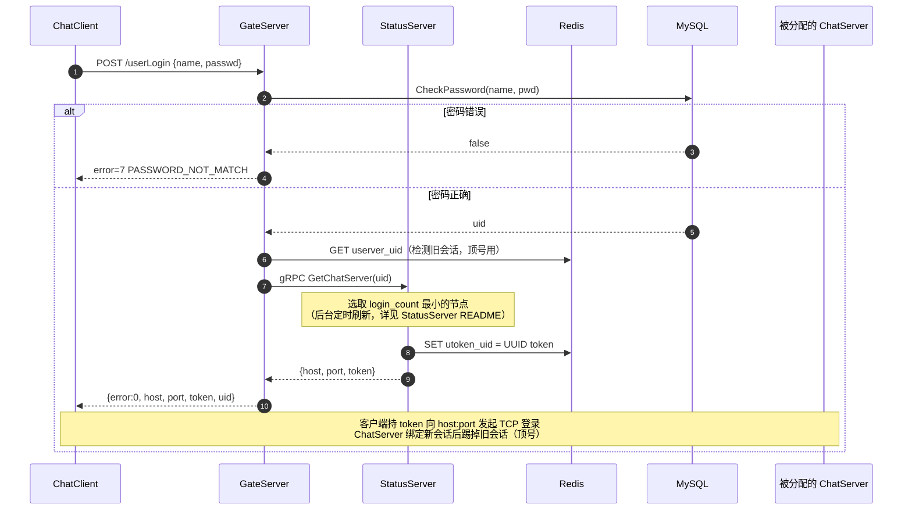

# GateServer

## 简介

GateServer 是客户端访问系统的 **HTTP 网关**（Boost.Beast，默认 :9090），负责注册、登录、验证码、改密四类入口请求。它自身不持有复杂状态，而是编排 VerifyServer（验证码）、StatusServer（分配聊天节点、颁发 token）、MySQL（用户数据）与 Redis（验证码缓存）。

## 目录

- [架构组成](#架构组成)
- [内部处理流程](#内部处理流程)
- [路由表](#路由表)
- [时序图：获取验证码 + 注册](#时序图获取验证码--注册)
- [时序图：重置密码](#时序图重置密码)
- [时序图：登录与聊天节点分配](#时序图登录与聊天节点分配)
- [开发者注意](#开发者注意)

## 架构组成

| 模块 | 说明 |
|---|---|
| CServer | HTTP 服务器，Asio 线程池 accept |
| HttpConnection | 单连接生命周期：读请求 → 交 LogicSystem 分发 → 写响应并关闭 |
| LogicSystem | 维护 GET/POST 路由表，执行业务 Handler，`Defer` 统一回包 |

## 内部处理流程

## 路由表

| 路径 | 方法 | 说明 |
|---|---|---|
| `/getVerifyCode` | POST | gRPC 调 VerifyServer 生成验证码并存 Redis、发邮件 |
| `/registerUser` | POST | 校验验证码后注册新用户 |
| `/resetPassword` | POST | 校验验证码 + 校验姓名邮箱后修改密码 |
| `/userLogin` | POST | 校验密码，向 StatusServer 申请 ChatServer 节点与 token |

> Redis 中验证码 key 为 `code_{email}`，由 VerifyServer 写入并带过期时间（600 秒）。
>
> ⚠️ **错误码体系不一致**：`/getVerifyCode` 的错误码由 VerifyServer 原样透传，其编号是 Node.js 侧定义（0 成功 / 1 Redis 错误 / 2 异常 / **3 验证码已存在**），与本服务 C++ `ErrorCodes` **并非同一套**。客户端在 `/getVerifyCode` 接口下收到 `error=3` 表示"10 分钟内已获取过验证码"，而不是 C++ 侧的"验证码过期"。详见 [VerifyServer/README.md](../VerifyServer/README.md#错误码本服务自有编号)。

## 时序图：获取验证码 + 注册

> 注册依赖 **`user_id` 发号器表**：`RegUserTransaction` 在事务内执行 `UPDATE user_id SET id = LAST_INSERT_ID(id + 1)` 取新 uid。**漏建该表会导致注册失败**，建表语句见 [DEPLOY.md](../DEPLOY.md)。

## 时序图：重置密码

## 时序图：登录与聊天节点分配

本流程由 GateServer 编排，StatusServer 选节点并发 token，客户端随后与返回的 ChatServer 建立 TCP 长连接（连接后的登录校验见 [ChatServer 时序图](../ChatServer/README.md#tcp-登录二次校验)）。

> **顶号策略**：登录不再因"账号已在线"被拒绝。检测到 `userver_{uid}` 路由记录时 GateServer 正常放行，由 ChatServer 在 TCP 登录时踢掉旧会话（同节点直发 `NOTIFY_KICK`，跨节点走 `ChatService.NotifyKickUser` gRPC）。旧节点已下线导致的残留路由键也会被本次登录覆盖，实现自愈。

## 开发者注意

- Handler 已全部使用 `Defer` 兜底写响应，新增错误分支直接 `return`
- 请求体可能含密码，日志只打印 email/name，**禁止打印整个 body**
- 无 TLS、无 CORS 头、无限流——生产环境建议前置 Nginx（终止 TLS、限流、CORS）
- 单线程编译验证：`cmake --build build --target gateServer -j1`
