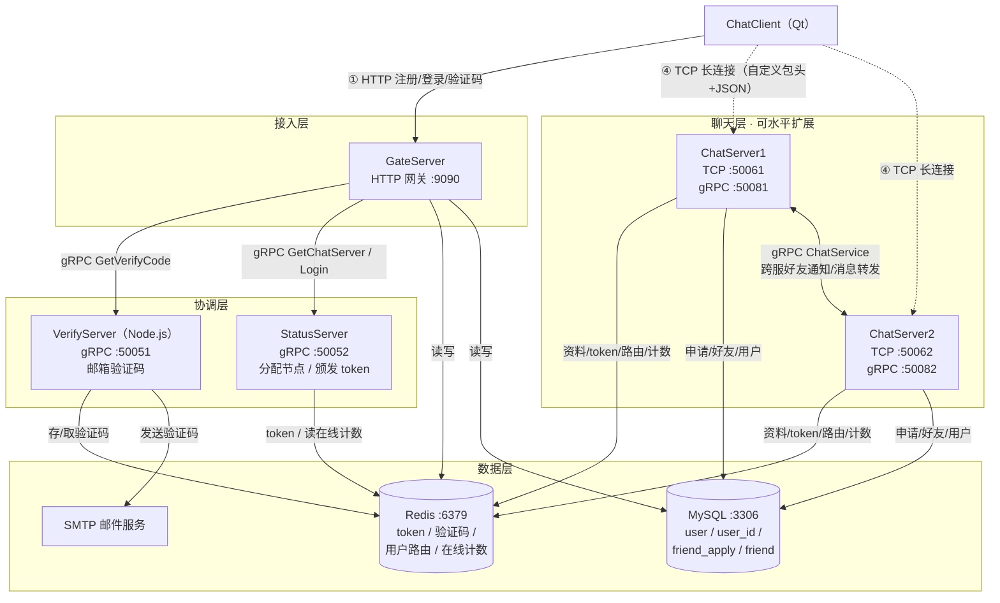

# Chat 服务端集群

## 📖 项目简介

这是即时通讯系统的服务端部分，包含三个 C++ 业务服务与一个 Node.js 验证服务。服务端采用 **公共静态库 + 业务子项目** 的分层架构：基础设施（Redis / MySQL / gRPC 客户端 / proto / 单例 / 常量）抽取到 `common/` 静态库统一复用，三个业务 server 只保留各自独有的 TCP / HTTP / gRPC 服务实现。Qt 客户端代码位于同级目录 [../Client](../Client/README.md)。

> **本目录是服务端的构建入口。** 仓库根目录没有 `CMakeLists.txt`，所有服务端构建命令都在 `Servers/` 下执行。

## 目录

- [📖 项目简介](#-项目简介)
- [🏗️ 系统架构](#️-系统架构)
- [🔄 核心业务流程](#-核心业务流程)
- [🧩 各服务内部流程](#-各服务内部流程)
- [📁 项目结构](#-项目结构)
- [🚀 快速开始](#-快速开始)
- [📝 接口与协议](#-接口与协议)
- [🔧 故障排除](#-故障排除)
- [📚 相关文档](#-相关文档)

### 核心特性

- **用户认证系统**：支持用户登录、注册、密码重置（邮箱验证码）
- **负载均衡接入**：StatusServer 按在线人数把新连接分配给最空闲的 ChatServer
- **分布式聊天节点**：可水平扩展多个 ChatServer，节点间通过 gRPC 跨服推送
- **好友系统**：搜索用户、好友申请、同意/拒绝（`action=1/2`）、拒绝后重新申请自动复位
- **MySQL 数据库**：用户信息、好友申请与好友关系持久化
- **Redis 缓存**：验证码、token、用户资料、用户路由、在线计数
- **公共库统一**：`libchat_common.a` 沉淀基础设施，三个 server 零重复代码

### 技术栈

| 组件 | 技术 |
|------|------|
| 客户端 | Qt 6, C++17 |
| 服务端 | C++17, gRPC, Boost.Asio, MySQL, Redis |
| 公共库 | C++17 静态库 `chat_common`（含 gRPC/Boost/hiredis/redis++/mysqlcppconn/jsoncpp） |
| 验证服务 | Node.js, gRPC, ioredis, nodemailer |

---

## 🏗️ 系统架构



**三个 C++ server 都依赖 `libchat_common.a`**，公共代码通过 `target_link_libraries(... chat_common)` 传递。

### 端口一览

| 服务 | 协议 | 端口 | 说明 |
|---|---|---|---|
| GateServer | HTTP | 9090 | 客户端注册/登录/验证码入口 |
| VerifyServer | gRPC | 50051 | `VerifyService.GetVerifyCode` |
| StatusServer | gRPC | 50052 | `StatusService.GetChatServer / Login` |
| ChatServer1 | TCP / gRPC | 50061 / 50081 | 聊天节点 1（客户端口 / 节点间口） |
| ChatServer2 | TCP / gRPC | 50062 / 50082 | 聊天节点 2 |

---

## 🔄 核心业务流程

各业务的端到端时序图按服务归属放在对应文档中：

| 业务流程 | 时序图位置 |
|---|---|
| 获取邮箱验证码 | [GateServer/README.md](GateServer/README.md#时序图获取验证码--注册) |
| 用户注册（验证码校验 + 落库） | [GateServer/README.md](GateServer/README.md#时序图获取验证码--注册) |
| 重置密码 | [GateServer/README.md](GateServer/README.md#时序图重置密码) |
| HTTP 登录与聊天节点分配 | [GateServer/README.md](GateServer/README.md#时序图登录与聊天节点分配) |
| TCP 登录二次校验（拉好友/申请列表） | [ChatServer/README.md](ChatServer/README.md#tcp-登录二次校验) |
| 发送好友申请（离线 / 同服 / 跨服） | [ChatServer/README.md](ChatServer/README.md#发送好友申请a--b含跨服) |
| 同意 / 拒绝好友申请（action 1/2） | [ChatServer/README.md](ChatServer/README.md#同意--拒绝好友申请b-处理-a-的申请含跨服) |
| 好友申请状态机（0 待处理 / 1 同意 / 2 拒绝） | [ChatServer/README.md](ChatServer/README.md#好友申请状态机friend_applystatus) |
| 发送文本聊天消息（同服 / 跨服） | [ChatServer/README.md](ChatServer/README.md#发送文本聊天消息a--b含跨服) |
| 获取验证码（VerifyServer 内部流程） | [VerifyServer/README.md](VerifyServer/README.md#时序图获取验证码) |
| StatusServer token 校验（TCP 登录时由 ChatServer 调用） | [StatusServer/README.md](StatusServer/README.md#token-校验流程login) |

一次完整登录的串联关系：客户端先请求 GateServer `/userLogin` → StatusServer 选出节点并颁发 token → 客户端与该 ChatServer 建立 TCP 长连接，ChatServer 通过 gRPC 调 StatusServer 完成 token 二次校验。

---

## 🧩 各服务内部流程

| 服务 | 职责 | 内部流程图 / 细节文档 |
|---|---|---|
| common | 公共静态库：协议/常量/日志/配置/连接池/gRPC 客户端 | [common/README.md](common/README.md) |
| GateServer | HTTP 网关：注册、登录、验证码、改密 | [GateServer/README.md](GateServer/README.md#内部处理流程) |
| ChatServer | TCP 长连接、好友业务、文本聊天、跨服 gRPC 推送 | [ChatServer/README.md](ChatServer/README.md#内部处理流程) |
| StatusServer | 最小负载选节点、颁发/校验 token | [StatusServer/README.md](StatusServer/README.md#内部流程后台负载刷新--请求分配) |
| VerifyServer | Node.js 邮件验证码 gRPC 服务 | [VerifyServer/README.md](VerifyServer/README.md) |

### TCP 消息协议速览（ChatServer）

帧格式：`2 字节 msgId + 2 字节 body 长度 + JSON body`（网络字节序 / 大端）。**单帧 body 硬上限 2048 字节。**

| msgId | 名称 | 方向 |
|---|---|---|
| 10001/10002 | CHAT_LOGIN_REQ/RSP | 登录（token 二次校验） |
| 10003/10004 | SEARCH_USER_REQ/RSP | 按 uid 搜人 |
| 10005/10006 | ADD_FRIEND_REQ/RSP | 好友申请 |
| 10007/10008 | NOTIFY_ADD_FRIEND_REQ/RSP | 推送"有人申请加你" |
| 10009/10010 | AUTH_FRIEND_REQ/RSP | 同意/拒绝好友申请（action 1/2） |
| 10011/10012 | NOTIFY_AUTH_FRIEND_REQ/RSP | 推送认证结果给申请者 |
| 10013/10014 | TEXT_CHAT_MSG_REQ/RSP | 批量文本聊天（text_array） |
| 10015/10016 | NOTIFY_TEXT_CHAT_MSG_REQ/RSP | 推送对端文本消息 |
| 99999 | CHAT_HEARTBEAT | 心跳（客户端 30s） |

完整字段约定（from_uid/to_uid/action 语义）见 [ChatServer/README.md](ChatServer/README.md#消息协议)。

---

## 📁 项目结构

```
chat/
├── CMakeLists.txt                 # 顶层 CMake（add_subdirectory: common → 3 servers）
│
├── common/                        # 公共静态库 libchat_common.a
│   ├── CMakeLists.txt             # 定义静态库 + proto 自动生成
│   ├── include/chat/              # 公共头文件（用 #include "chat/xxx.h" 引用）
│   │   ├── noncopyable.h          #   - DISALLOW_COPY_MOVE 宏
│   │   ├── constants.h            #   - Defer / ErrorCodes / MSG_IDS / 申请状态与 action 常量
│   │   ├── log.h                  #   - 统一日志宏 LOG_DEBUG/INFO/WARN/ERROR
│   │   ├── config_manager.h       #   - INI 配置解析
│   │   ├── redis_manager.h        #   - Redis 连接池
│   │   ├── mysql_dao.h            #   - MySQL DAO + 连接池
│   │   ├── mysql_manager.h        #   - MySQL 管理器
│   │   ├── rpc_stub_pool.h        #   - gRPC stub 连接池模板
│   │   ├── asio_io_context_pool.h #   - Asio I/O 线程池
│   │   ├── status_grpc_client.h   #   - StatusServer gRPC 客户端
│   │   └── verify_grpc_client.h   #   - VerifyServer gRPC 客户端
│   ├── src/                       # 公共实现
│   └── proto/message.proto        # 唯一 proto 源（生成至 build/common/grpc_gen/）
│
├── ChatServer/                    # TCP 聊天服务（业务层，可多实例）
│   ├── main.cpp / config.ini / config2.ini
│   └── src/
│       ├── cserver.h/cpp          #   - TCP server，session 生命周期
│       ├── csession.h/cpp         #   - 连接会话，包头/JSON 读写
│       ├── msg_node.h/cpp         #   - 消息节点
│       ├── user_manager.h/cpp     #   - uid → session 映射
│       ├── logic_system.h/cpp     #   - 登录/搜人/好友申请/认证
│       ├── chat_grpc_client.h/cpp #   - 向其他 ChatServer 发起 gRPC
│       └── chat_service_impl.h/cpp#   - 处理其他 ChatServer 的 gRPC 通知
│
├── GateServer/                    # HTTP 网关服务（业务层）
│   ├── main.cpp / config.ini
│   └── src/
│       ├── cserver.h/cpp          #   - HTTP server
│       ├── http_connection.h/cpp  #   - HTTP 连接与请求分发
│       └── logic_system.h/cpp     #   - 注册/登录/重置/验证码 Handler
│
├── StatusServer/                  # gRPC 状态/协调服务（业务层）
│   ├── main.cpp / config.ini
│   └── src/status_service_impl.h/cpp  # 节点分配、token 颁发、负载刷新
│
├── VerifyServer/                  # Node.js 邮件验证服务（gRPC :50051）
│
├── build/                         # 统一构建目录
├── logs/                          # 各服务运行日志
├── start.sh / status.sh / stop.sh # 服务管理脚本
└── 文档：README.md / REFACTORING.md / DEPLOY.md
```

---

## 🚀 快速开始

### 环境要求

| 组件 | 版本要求 |
|------|----------|
| 操作系统 | Linux (Ubuntu 20.04+) |
| C++ 编译器 | GCC 12+（需完整 C++17 支持） |
| CMake | **3.20+**（本项目 CMakeLists 显式要求 3.20），Ninja（推荐） |
| Node.js | 14+ |
| MySQL | 5.7+，Redis 5.0+ |
| gRPC / Protobuf | 系统安装（含 `protoc`、`grpc_cpp_plugin`） |
| Boost | 1.74+（filesystem / uuid） |
| hiredis / redis++ / mysqlcppconn / jsoncpp | 系统安装 |

```bash
sudo apt update
sudo apt install -y build-essential git cmake ninja-build pkg-config libssl-dev zlib1g-dev \
    mysql-server redis-server libmysqlcppconn-dev libhiredis-dev libjsoncpp-dev \
    libboost-all-dev
# gRPC/Protobuf、redis++ 需按官方文档源码安装
```

### 构建

```bash
cd Servers                        # ⚠️ 入口是 Servers/，不是仓库根目录
cmake -S . -B build -G Ninja
cmake --build build -j$(nproc)    # 全量构建

# 或只构建单个目标
cmake --build build --target chatServer   -j$(nproc)
cmake --build build --target gateServer   -j$(nproc)
cmake --build build --target statusServer -j$(nproc)
```

产物：`build/common/libchat_common.a`、`build/{ChatServer,GateServer,StatusServer}/`（含可执行文件与 config.ini）。

### 启动

```bash
./start.sh    # Redis → VerifyServer → GateServer → ChatServer1/2 → StatusServer
./status.sh   # 查看状态
./stop.sh     # 反序停止
```

### 数据库初始化

```sql
CREATE DATABASE IF NOT EXISTS chat_db CHARACTER SET utf8mb4 COLLATE utf8mb4_unicode_ci;
-- 用户名/口令替换为实际值，并与 Servers/.env 中的 MYSQL_USER / MYSQL_PASSWORD 保持一致
CREATE USER IF NOT EXISTS 'your_mysql_user'@'localhost' IDENTIFIED BY 'your_mysql_password';
GRANT ALL PRIVILEGES ON chat_db.* TO 'your_mysql_user'@'localhost';
FLUSH PRIVILEGES;
```

核心表：

| 表 | 用途 | 关键约束 |
|---|---|---|
| `user` | 用户账号与资料 | 主键 `uid`，`email` 唯一 |
| **`user_id`** | **全局发号器（注册取号）** | 单行表，事务内 `UPDATE ... LAST_INSERT_ID(id+1)` |
| `friend_apply` | 好友申请 | 唯一键 `(from_uid, to_uid)`，含 `status` |
| `friend` | 好友关系 | — |

> ⚠️ **`user_id` 表是注册流程的硬依赖**：`mysql_dao.cpp` 的 `RegUserTransaction` 会在事务内执行 `UPDATE user_id SET id = LAST_INSERT_ID(id + 1)` 取新 uid。**漏建这张表会导致注册直接失败**。建表语句见 [DEPLOY.md](DEPLOY.md)。

---

## 📝 接口与协议

### HTTP 接口（GateServer :9090）

| 路径 | 方法 | 说明 |
|---|---|---|
| `/getVerifyCode` | POST | 获取邮箱验证码（gRPC 调 VerifyServer） |
| `/registerUser` | POST | 注册新用户 |
| `/resetPassword` | POST | 重置密码 |
| `/userLogin` | POST | 登录，返回 ChatServer 的 host/port 与 token |

### gRPC 接口（common/proto/message.proto）

```protobuf
service VerifyService { rpc GetVerifyCode(GetVerifyReq) returns (GetVerifyRsp); }

service StatusService {
  rpc GetChatServer(GetChatServerReq) returns (GetChatServerRsp);  // 分配节点 + 颁发 token
  rpc Login(LoginReq) returns (LoginRsp);                          // 校验 token（TCP 登录时由 ChatServer 调用）
}

service ChatService {  // ChatServer 节点间
  rpc NotifyAddFriend(AddFriendReq) returns (AddFriendRsp);
  rpc ReplyFriend(ReplyFriendReq) returns (ReplyFriendRsp);
  rpc SendChatMsg(SendChatMsgReq) returns (SendChatMsgRsp);
  rpc NotifyFriendAccepted(FriendAcceptedReq) returns (FriendAcceptedRsp); // action: 1同意 2拒绝
  rpc NotifyTextChatMsg(TextChatMsgReq) returns (TextChatMsgRsp);
  rpc NotifyKickUser(KickUserReq) returns (KickUserRsp);
}
```

### 错误码

| 值 | 枚举 | 含义 |
|---|---|---|
| 0 | SUCCESS | 成功 |
| 1 | ERROR_JSON | JSON 解析/字段/action 非法 |
| 2 | RPC_FAILED | gRPC 调用失败 |
| 3 | VERIFYCODE_NOT_FOUND_OR_EXPIRED | 验证码不存在或过期 |
| 4 | USER_EXIST | 用户/邮箱已存在 |
| 5 | EMAIL_NOT_MATCH | 重置密码时姓名邮箱不匹配 |
| 6 | UPDATE_PASSWORD_FAILED | 更新密码失败 |
| 7 | PASSWORD_NOT_MATCH | 密码错误 |
| 8 | UID_INVALID | 用户不存在/资料拉取失败 |
| 9 | TOKEN_INVALID | token 无效 |
| 10 | USER_ALREADY_LOGIN | 账号已在线，拒绝重复登录（Gate `/userLogin` 拦截） |

---

## 🔧 故障排除

| 现象 | 排查 |
|---|---|
| `cmake: no such file or directory: CMakeLists.txt` | 你不在 `Servers/` 目录。根目录没有 CMakeLists |
| CMake 报版本过低（要求 3.20） | `cmake --version` 确认 ≥ 3.20；Ubuntu 20.04 自带过低，需装新版 |
| 编译找不到 `chat/xxx.h` | 确认在 `Servers/` 下构建，重新 `cmake -S . -B build -G Ninja` |
| MySQL 2014 Commands out of sync | 已在连接池修复（健康检查消费结果集、异常连接丢弃）；确认用的是最新代码 |
| MySQL 连接失败 | `service mysql status`；核对 `config.ini` 的 `[MySQL]` |
| 注册报错 / uid 异常 | 检查是否漏建 `user_id` 表 |
| Redis 连接失败 | `redis-cli ping`；核对 `[Redis]` |
| gRPC 连不上 | `pgrep -f "node.*server.js"`；看 `logs/` 下对应日志 |
| 本地起服务后客户端连不上聊天节点 | `StatusServer/config.ini` 里的 ChatServer Host 是公网 IP，本地需改成 `127.0.0.1` |
| 端口占用 | 9090 / 50051 / 50052 / 50061 / 50062 / 50081 / 50082 |
| 配置加载失败 | 可执行文件与 `config.ini` 必须同目录（`build/<server>/`） |

日志统一格式：`[时间戳(毫秒)] [级别] 内容`，位于 `logs/`。

---

## ⚠️ 安全提示

以下问题在源码中真实存在，**上线前必须处理**：

| 问题 | 位置 | 建议 |
|---|---|---|
| 数据库账号密码明文写在配置里 | 各 `config.ini` 的 `[MySQL]` | 改用环境变量或密文配置，配置不入库 |
| 邮箱 SMTP 授权码明文 | `VerifyServer/config.json` | 立即轮换该授权码，改用环境变量注入 |
| 密码存储方式 | GateServer + MySQL | 改用 bcrypt / argon2 加盐哈希 |
| 无 gRPC 鉴权 | 各服务间 gRPC | 内网部署 + mTLS，或加服务间 token |
| 无 TLS | GateServer HTTP | 前置 Nginx 终止 TLS |

---

## 📚 相关文档

| 文档 | 说明 |
|---|---|
| [common/README.md](common/README.md) | 公共静态库：组件架构、proto 契约、连接池行为约定 |
| [GateServer/README.md](GateServer/README.md) | HTTP 网关：内部流程图、注册/验证码/重置/登录时序 |
| [ChatServer/README.md](ChatServer/README.md) | ChatServer：TCP 流程图、登录校验、好友申请/认证/文本聊天时序与状态机、消息协议 |
| [StatusServer/README.md](StatusServer/README.md) | 协调服务：后台负载刷新流程图、token 校验时序 |
| [VerifyServer/README.md](VerifyServer/README.md) | Node.js 验证服务：GetVerifyCode 流程、SMTP 重试、错误码 |
| [REFACTORING.md](REFACTORING.md) | 三 Server 解耦设计思路 |
| [DEPLOY.md](DEPLOY.md) | 部署与运维指南 |
