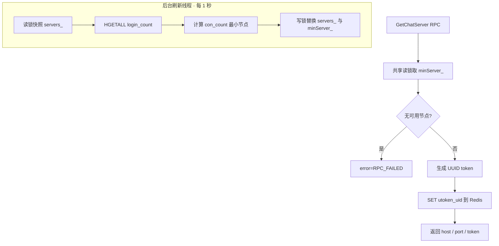
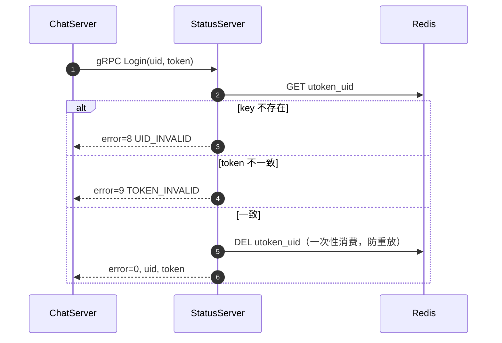

# StatusServer

## 简介

StatusServer 是系统的 **gRPC 协调服务**（默认 :50052），提供两个能力：

- **GetChatServer**：按各 ChatServer 节点的在线连接数（Redis Hash `login_count`）选出负载最低的节点，返回其 host/port，并生成 UUID token 写入 Redis（`utoken_{uid}`）
- **Login**：校验 uid + token 是否有效（接口已实现，由 ChatServer 的 TCP 登录流程调用）

节点列表来自 `config.ini` 的 `[ChatServers]` 段；后台线程每 1 秒刷新一次最小负载节点缓存，RPC 请求只做短时间持锁的内存读取，不被 Redis IO 阻塞。

## 目录

- [gRPC 接口](#grpc-接口)
- [内部流程：后台负载刷新 + 请求分配](#内部流程后台负载刷新--请求分配)
- [Token 校验流程（Login）](#token-校验流程login)
- [并发模型](#并发模型)
- [配置](#配置)
- [开发者注意](#开发者注意)

## gRPC 接口

```protobuf
service StatusService {
  rpc GetChatServer(GetChatServerReq) returns (GetChatServerRsp); // 分配节点 + 颁发 token
  rpc Login(LoginReq) returns (LoginRsp);                         // token 校验
}
```

## 内部流程：后台负载刷新 + 请求分配



> 刷新失败（Redis 异常、配置为空）时保留上一轮缓存，不用空数据覆盖；`stoi` 等异常由外层 catch 兜住，刷新线程不会中断。

## Token 校验流程（Login）



> **token 的生命周期**：
> 1. `GetChatServer` 时写入 `utoken_{uid}`
> 2. ChatServer 的 TCP 登录通过 `Login` 校验后**删除**（一次性消费）
> 3. 会话正常断开时 ChatServer 也会删除该键
>
> ⚠️ 若 ChatServer 进程异常退出未及清理，旧 token 会残留在 Redis 中（此时 GateServer 侧防重复登录也会一并受影响，需人工 `DEL` 清理）。**建议给 `utoken_{uid}` 加 TTL**。

## 并发模型

- `servers_ / minServer_` 由 `std::shared_mutex` 保护：后台刷新偶尔写，RPC 高频读
- 刷新线程通过 `running_` 标志 + 100ms 小步睡眠支持快速退出，析构时 `join`
- UUID 生成器使用 `thread_local`，避免多线程竞争

## 配置

`config.ini` 中的节点列表与地址：

```ini
[StatusServer]
Host = 127.0.0.1
Port = 50052

[ChatServers]
Name = ChatServer1,ChatServer2      # 逗号分隔的节点名列表

[ChatServer1]
Name = ChatServer1
Host = 127.0.0.1                    # ⚠️ 默认配置里可能写成公网 IP
Port = 50061

[ChatServer2]
Name = ChatServer2
Host = 127.0.0.1
Port = 50062
```

> ⚠️ **这里的 `Host` 是下发到客户端的连接地址**，必须是**客户端能访问到的地址**：
> - 本地调试 → `127.0.0.1`
> - 内网部署 → 内网 IP
> - 公网部署 → 公网 IP 或域名
>
> 若填错，表现为：HTTP 登录成功但客户端 TCP 连不上聊天节点。

## 开发者注意

- 新增 ChatServer 节点时，在 `config.ini` 的 `[ChatServers] Name=...` 中登记，并添加对应节点 section；同时要在各 ChatServer 的 `[PeerServer]` / `[ChatServerN]` 中补齐对端信息
- 单线程编译验证：`cmake --build build --target statusServer -j1`
