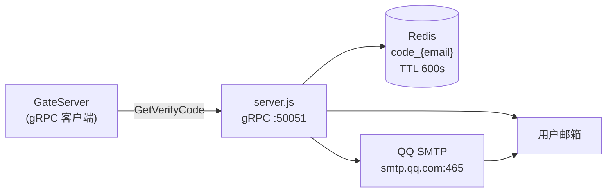
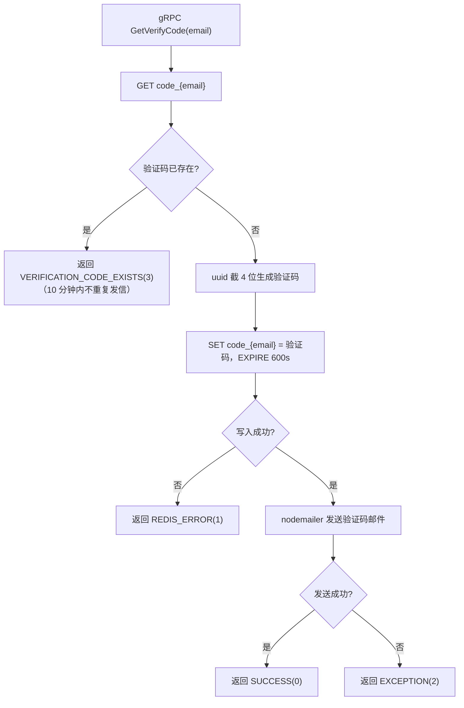
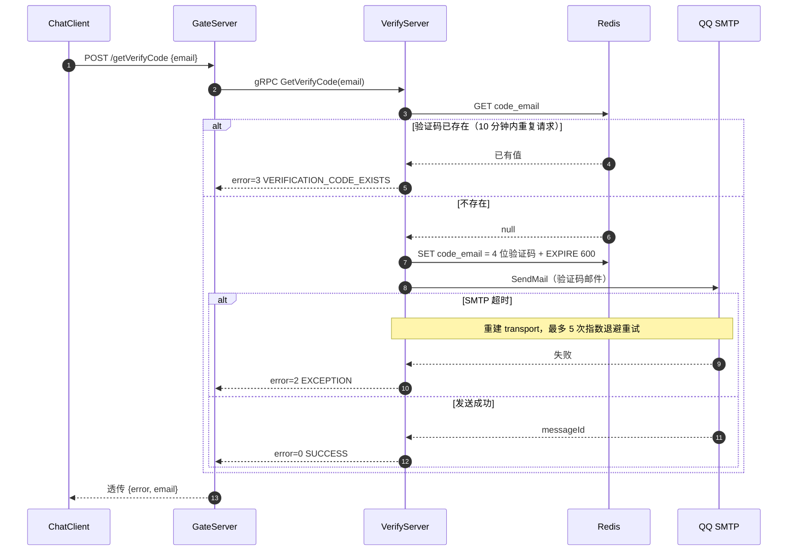

# VerifyServer 邮件验证码服务

## 简介

VerifyServer 是基于 **Node.js** 的 gRPC 服务（默认 `127.0.0.1:50051`），对外只提供一个能力：`VerifyService.GetVerifyCode` —— 生成 4 位验证码、写入 Redis（TTL 600 秒）并通过 QQ 邮箱 SMTP 发送给用户。

它不直接面向客户端：客户端请求 GateServer 的 `/getVerifyCode`，由 GateServer 通过 gRPC 调用本服务。

## 目录

- [技术栈](#技术栈)
- [文件清单](#文件清单)
- [内部架构](#内部架构)
- [GetVerifyCode 处理流程](#getverifycode-处理流程)
- [时序图：获取验证码](#时序图获取验证码)
- [可靠性设计](#可靠性设计)
- [错误码（本服务自有编号）](#错误码本服务自有编号)
- [安装与运行](#安装与运行)

## 技术栈

| 类别 | 选型 |
|---|---|
| 运行时 | Node.js 14+ |
| gRPC | `@grpc/grpc-js` + `@grpc/proto-loader` |
| Redis | `ioredis` |
| 邮件 | `nodemailer`（smtp.qq.com:465 SSL） |
| 唯一码 | `uuid`（截前 4 位作为验证码） |

## 文件清单

| 文件 | 说明 |
|---|---|
| [server.js](../VerifyServer/server.js) | gRPC 服务入口，实现 `GetVerifyCode`，注册 SIGINT/SIGTERM 优雅关闭 |
| [email.js](../VerifyServer/email.js) | nodemailer 单连接封装：发信、超时重建、指数退避重试 |
| [redis.js](../VerifyServer/redis.js) | ioredis 客户端：`GetRedis` / `SetRedisExpire` / `QueryRedis` |
| [proto.js](../VerifyServer/proto.js) | 用 proto-loader 加载本目录 `message.proto` |
| [constants.js](../VerifyServer/constants.js) | `code_prefix="code_"` 与本服务自有错误码 |
| [config.js](../VerifyServer/config.js) | 从 `config.json` 读取邮箱账号与 Redis 地址 |
| [config.json](../VerifyServer/config.json) | 邮箱 user/pass、Redis host/port（**含真实凭据，严禁提交/外泄**） |
| [message.proto](../VerifyServer/message.proto) | proto 副本（与 `common/proto/message.proto` 中的 VerifyService 对应） |
| [test-smtp.js](../VerifyServer/test-smtp.js) | SMTP 连通性手动测试脚本 |
| [package.json](../VerifyServer/package.json) | 依赖声明 |

## 内部架构



## GetVerifyCode 处理流程



## 时序图：获取验证码



> 邮件正文形如：`您的验证码是 xxxx，请在 HH:MM 前完成注册。`（过期时间按 Asia/Shanghai 时区本地化）

## 可靠性设计

- **SMTP 单连接**：不做连接池，避免脏连接；仅在 `ETIMEDOUT` 时关闭并重建 transport
- **重试策略**：最多 5 次，初始等待 500ms 指数退避（500ms→1s→2s…）；`EENVELOPE` 等其他错误直接上抛不重试
- **超时参数**：connectionTimeout 15s、greetingTimeout 10s、socketTimeout 30s
- **Redis 异常**：ioredis error 事件中主动 quit；写验证码失败返回 REDIS_ERROR，不会出现"邮件发了但 Redis 没存"的成功响应
- **防重复发信**：10 分钟内同一邮箱重复请求直接返回已存在错误，不再次发信
- **优雅关闭**：SIGINT/SIGTERM 时关闭 SMTP 连接后 `process.exit(0)`

## 错误码（本服务自有编号）

⚠️ 注意：本服务的错误编号是 **Node.js 侧独立定义**，GateServer 不做翻译、直接透传 `error` 字段，因此与 C++ `ErrorCodes` **含义并非一一对应**：

| 值 | 名称 | 含义 | ⚠️ 与 C++ ErrorCodes 的同值差异 |
|---|---|---|---|
| 0 | SUCCESS | 验证码已生成并发送 | 一致 |
| 1 | REDIS_ERROR | Redis 写入失败 | C++ 侧 1=ERROR_JSON，**含义不同** |
| 2 | EXCEPTION | 发送过程异常 | C++ 侧 2=RPC_FAILED，**含义不同** |
| 3 | VERIFICATION_CODE_EXISTS | 该邮箱 10 分钟内已有有效验证码 | C++ 侧 3=验证码过期，**含义不同** |

> **建议**：把这两套错误码统一（例如给 VerifyServer 预留一段独立编号区间），避免客户端按同一套码表解析时误判。

## 安装与运行

```bash
cd <repo>/Servers/VerifyServer
npm install        # 安装依赖（首次）
node server.js     # 直接运行；生产环境由上层 start.sh 以 nohup 拉起
```

手动验证 SMTP 配置：`node test-smtp.js`。

## ⚠️ 安全提示

| 问题 | 说明 | 建议 |
|---|---|---|
| 明文凭据 | `config.json` 存放 QQ 邮箱授权码与 Redis 地址 | 立即轮换该授权码；改用环境变量注入；`config.json` 加入 `.gitignore` |
| 无并发限制 | 同一邮箱 10 分钟防重，但可换邮箱刷 | 加 IP 维度限流 |
| 验证码为 uuid 前 4 位 | 非密码学安全随机，且仅 4 位（可暴力枚举 1 万次） | 改用 `crypto.randomInt`，并限制单个邮箱的错误尝试次数 |

服务的启动顺序、日志位置（`../logs/verify_server.log`）与整体编排见 [../README.md](../README.md)。
