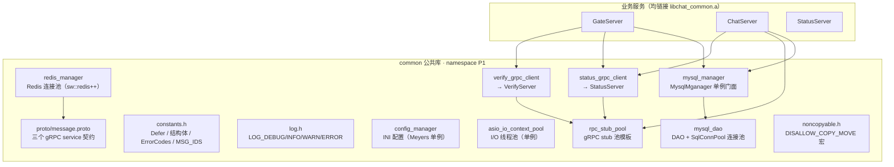

# common 公共静态库

## 简介

`common` 编译为静态库 **`libchat_common.a`**，是 GateServer / ChatServer / StatusServer 三个 C++ 服务共享的基础设施层。三个业务服务通过 `target_link_libraries(<server> PRIVATE chat_common)` 链接本库，所有外部依赖（gRPC、Boost、hiredis、redis++、mysqlcppconn、jsoncpp、OpenSSL）以 `PUBLIC` 方式自动向下传递，业务服务自身不再写任何依赖查找。

设计动机与解耦过程详见上层文档 [../REFACTORING.md](../REFACTORING.md)。

## 目录

- [组件架构](#组件架构)
- [目录与文件清单](#目录与文件清单)
- [gRPC 协议契约（message.proto）](#grpc-协议契约messageproto)
- [常量与协议号（constants.h）](#常量与协议号constantsh)
- [基础设施行为约定](#基础设施行为约定)
- [构建](#构建)

## 组件架构



## 目录与文件清单

| 文件 | 说明 |
|---|---|
| [CMakeLists.txt](../common/CMakeLists.txt) | 定义 `chat_common` 静态库；protoc/grpc_cpp_plugin 自动生成代码到 `build/common/grpc_gen/` |
| [proto/message.proto](../common/proto/message.proto) | 全局唯一 proto 源，定义全部 gRPC 接口与消息 |
| `include/chat/noncopyable.h` | `DISALLOW_COPY_MOVE(ClassName)` 宏，禁用拷贝与移动 |
| [include/chat/log.h](../common/include/chat/log.h) | 统一日志宏，见下文 |
| [include/chat/constants.h](../common/include/chat/constants.h) | `Defer`、`UserInfo`/`ApplyInfo`、Redis key 前缀、状态/动作常量、`ErrorCodes`、`MSG_IDS` |
| `include/chat/config_manager.h` / `src/config_manager.cpp` | INI 配置解析单例 |
| `include/chat/asio_io_context_pool.h` / `src/asio_io_context_pool.cpp` | Asio io_context 线程池单例 |
| `include/chat/redis_manager.h` / `src/redis_manager.cpp` | Redis 连接池单例 |
| `include/chat/mysql_dao.h` / `src/mysql_dao.cpp` | MySQL DAO 与内部连接池 |
| `include/chat/mysql_manager.h` / `src/mysql_manager.cpp` | MySQL 管理器单例（类名拼写为 `MysqlMganager`，历史遗留） |
| `include/chat/rpc_stub_pool.h` | gRPC stub 连接池类模板（header-only） |
| `include/chat/status_grpc_client.h` / `src/status_grpc_client.cpp` | StatusServer gRPC 客户端单例 |
| `include/chat/verify_grpc_client.h` / `src/verify_grpc_client.cpp` | VerifyServer gRPC 客户端单例 |

> 公共库所有符号位于命名空间 **`P1`**；头文件统一以 `#include "chat/xxx.h"` 方式引用。

## gRPC 协议契约（message.proto）

一个 proto 文件定义三个 service：

```protobuf
service VerifyService {
  rpc GetVerifyCode(GetVerifyReq) returns (GetVerifyRsp);          // 邮箱验证码
}

service StatusService {
  rpc GetChatServer(GetChatServerReq) returns (GetChatServerRsp);   // 分配聊天节点 + 颁发 token
  rpc Login(LoginReq) returns (LoginRsp);                           // token 校验（TCP 登录时由 ChatServer 调用）
}

service ChatService {                                              // ChatServer 节点间
  rpc NotifyAddFriend(AddFriendReq) returns (AddFriendRsp);         // 已实现
  rpc ReplyFriend(ReplyFriendReq) returns (ReplyFriendRsp);         // 已定义，暂无调用
  rpc SendChatMsg(SendChatMsgReq) returns (SendChatMsgRsp);         // 已定义，暂无调用
  rpc NotifyFriendAccepted(FriendAcceptedReq) returns (FriendAcceptedRsp);  // 已实现
  rpc NotifyTextChatMsg(TextChatMsgReq) returns (TextChatMsgRsp);   // 已实现
  rpc NotifyKickUser(KickUserReq) returns (KickUserRsp);            // 已实现（顶号踢下线）
}
```

## 常量与协议号（constants.h）

### Redis 键约定

| 前缀 / 键 | 含义 | 写入方 |
|---|---|---|
| `utoken_{uid}` | 本次登录的 token | StatusServer 颁发，ChatServer 登录时经 StatusServer 校验后删除 |
| `uinfo_{uid}` | 用户资料 JSON 缓存 | ChatServer（miss 回源 MySQL 并回填），退出删除 |
| `userver_{uid}` | 用户所在 ChatServer 节点名（跨服路由依据） | ChatServer 登录写入，退出时校验后删除 |
| Hash `login_count` | 各节点在线连接计数 | ChatServer 登录 +1、退出 -1、进程退出 HDel 节点 |

> 验证码 key `code_{email}` 由 Node.js VerifyServer 写入（TTL 600 秒），仅在 GateServer 读取，故前缀常量只定义在 GateServer 与 VerifyServer 中。
>
> ⚠️ **`userver_{uid}` 目前不设 TTL**：若进程异常退出未清理，该键会残留，跨服路由可能短暂指向已下线节点（消息推送按"用户不在线"丢弃，无实质影响）。残留键会在用户下次登录时被顶号流程覆盖，实现自愈；彻底治理仍建议加 TTL 并由心跳续期。

### 好友申请状态 / 认证动作

- `friend_apply.status`：`APPLY_STATUS_PENDING=0`（待处理）、`APPLY_STATUS_ACCEPTED=1`（同意）、`APPLY_STATUS_REJECTED=2`（拒绝）
- `AUTH_FRIEND_REQ.action`：`FRIEND_ACTION_ACCEPT=1`、`FRIEND_ACTION_REJECT=2`

### ErrorCodes

`ErrorCodes` 是 C++ 服务间及服务端与客户端共享的整数契约：

| 值 | 枚举 | 含义 |
|---|---|---|
| 0 | SUCCESS | 成功 |
| 1 | ERROR_JSON | JSON 解析 / 字段 / action 非法 |
| 2 | RPC_FAILED | gRPC 调用失败 |
| 3 | VERIFYCODE_NOT_FOUND_OR_EXPIRED | 验证码不存在或已过期 |
| 4 | USER_EXIST | 用户名 / 邮箱已存在 |
| 5 | EMAIL_NOT_MATCH | 改密时姓名与邮箱不匹配 |
| 6 | UPDATE_PASSWORD_FAILED | 更新密码失败 |
| 7 | PASSWORD_NOT_MATCH | 密码错误 |
| 8 | UID_INVALID | 用户不存在 / 资料拉取失败 |
| 9 | TOKEN_INVALID | token 无效 |
| 10 | USER_ALREADY_LOGIN | 账号已在线，拒绝重复登录 |

### MSG_IDS（ChatServer TCP 消息号）

`10001~10016` 为业务消息：

| 消息号 | 含义 |
|---|---|
| 10001 / 10002 | 登录请求 / 响应 |
| 10003 / 10004 | 搜索用户请求 / 响应 |
| 10005 / 10006 | 加好友请求 / 响应 |
| 10007 / 10008 | 加好友通知 / 响应 |
| 10009 / 10010 | 好友认证请求 / 响应 |
| 10011 / 10012 | 认证通知 / 响应 |
| 10013 / 10014 | 文本聊天请求 / 响应 |
| 10015 / 10016 | 文本聊天通知 / 响应 |
| 99999 | 心跳包 |

完整字段语义见 [../ChatServer/README.md](../ChatServer/README.md#消息协议)。

## 基础设施行为约定

### 日志（log.h）

- 宏：`LOG_DEBUG / LOG_INFO / LOG_WARN / LOG_ERROR`，printf 风格可变参数
- 输出格式：`[yyyy-mm-dd hh:mm:ss.mmm] [LEVEL] message`，全局互斥锁保证多线程安全，输出到 stderr（由 `nohup` 重定向至 `logs/`）
- **全项目禁止使用 `std::cout / std::cerr / printf` 直接输出**

### 配置（config_manager）

- Meyers 单例；`Init()` 默认读 `./config.ini`，也可 `Init(path)` 指定（ChatServer 用 `config.ini` / `config2.ini` 起多实例）
- 取值模板 `GetValue<T>(section, key, default)`，基于 boost::lexical_cast 做类型转换
- 依赖"可执行文件与 config.ini 同目录"，因此各 server 产物分别落在 `build/<server>/`，不统一输出目录

### I/O 线程池（asio_io_context_pool）

- Meyers 单例，默认 2 个 io_context 线程；`GetIOService()` 按 round-robin 分配，下标 `nextIOContext_` 为 `std::atomic`
- 每个 io_context 用 `work_guard` 保活；`Stop()` 顺序：reset work_guard → io_context.stop() → join

### Redis（redis_manager）

- `RedisManagerPool` 单例，封装 sw::redis++；socket_timeout 200ms、connect_timeout 500ms、连接池大小 5、取连接 wait_timeout 100ms
- 未连接或取连接超时时 `Client()` 返回 nullptr，调用方必须判空；故障期间降频告警，避免日志风暴
- 提供 string / hash / list / generic 命令的完整封装

### MySQL（mysql_dao + mysql_manager）

- 内部类 `SqlConnPool`：`Acquire()` 取连接带 **3 秒超时**，池耗尽返回 nullptr（不永久阻塞）；后台健康检查线程周期性 `SELECT 1`（完整消费结果集），空闲连接按阈值 Reconnect 重连
- DAO 异常 catch 分支对连接执行 `reset()` 丢弃，避免脏连接回池（如 error 2014 Commands out of sync）
- 主要 DAO 方法：
  - `RegUserTransaction`：事务内 `UPDATE user_id SET id=LAST_INSERT_ID(id+1)` 取号并插入 user
  - `CheckEmail` / `UpdatePassword` / `CheckPassword`
  - `GetUserByUid` / `GetUserByName`
  - `AddFriendApply`：插入申请，`ON DUPLICATE KEY UPDATE status=0`（拒绝后重新申请自动复位）
  - `AuthFriendApply`：双向 UPDATE 申请状态
  - `AddFriend`：事务内双向 INSERT IGNORE 好友关系
  - `GetApplyList` / `GetFriendList`（JOIN 查询）
- `MysqlMganager`（注意拼写）是包装 `dao_` 的单例门面，业务层只接触管理器

### gRPC stub 池（rpc_stub_pool）

- 类模板 `RpcStubPool<ServiceType>`，每池默认 5 个 stub
- `GetStub()` 在 `stop_` / `initFailed_` / 非空谓词上等待，初始化失败或池关闭时返回 nullptr，调用方必须判空；`PutStub()` 归还
- `status_grpc_client`（默认 127.0.0.1:50052，5 stub）与 `verify_grpc_client`（默认 127.0.0.1:50051，5 stub）均为单例

## 构建

公共库不单独产出可执行文件，随顶层项目一起构建：

```bash
cd <repo>/Servers
cmake -S . -B build -G Ninja
cmake --build build -j$(nproc)     # 产物 build/common/libchat_common.a
```

proto 生成物（`message.pb.*` / `message.grpc.pb.*`）位于 `build/common/grpc_gen/`，不进入源码树。
